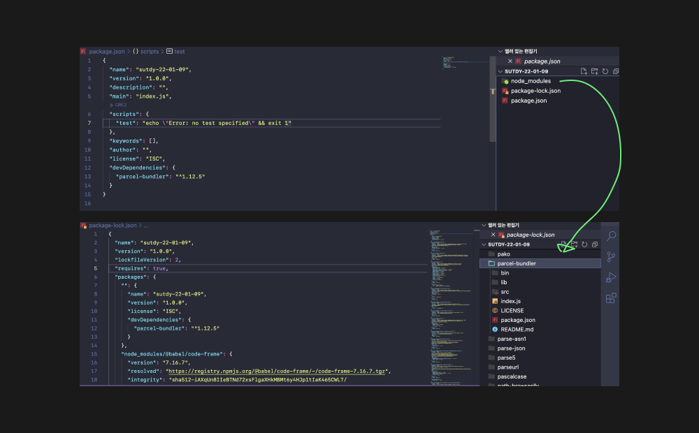

# Node.js 알아보기

`node.js` : chrome V8 JavaScript 엔진<sup>[1](#footnote_1)</sup> 으로 만들어진 JavaScript 런타임<sup>[2](#footnote_2)</sup>

JavaScript라는 프로그래밍 언어가 동작하는 컴퓨터 환경을 `node.js`라고 부른다.

웹 페이지를 개발하기 위한 약간의 도움을 받는 용도로 `node.js`를 쓰게 된다.

웹 브라우저에서는 HTML,CSS,JavaScript만 동작을 한다.

순수하게 위 세가지만 가지고 개발을 하게되면 비효율적일 수 있다.

그래서 개발을 도와주는 여러가지 모듈[Sass,Babel같은]을 설치해서 도움을 받아 개발을 하게 되는데, 이런 모듈들은 브라우저에서 직접적으로 동작할 수 없기때문에 node.js 환경을 통해서 JavaScript라는 프로그래밍 언어로 변환을 명령할 수 있다.

`npm`: Node Package Manager , 전 세계의 개발자들이 만든 다양한 기능(패키지, 모듈)들을 관리한다.

- npm은 생태계라고 볼 수 있다. 개발자들이 다양한 패키지를 만들어 npm 생태계에 기여, 업로드를 한다.

- 우리는 패키지를 모듈 혹은 기능으로 볼 수 있다.

- Trade-off(상충관계)

  - node.js환경에서 npm이라는 개념으로 각각의 패키지들을 설치, 관리, 동작을 시켜줘야함. 👉 당연히 그 방법을 이해해야하고, 활용방법을 공부해야함. 👉 난이도 증가 👉 프로젝트가 동작할 수 있는 기본적인 구성을 해줘야하는데 기존의 방식보다 훨씬 복잡하긴 함.

  - 그럼에도 불구하고, 프로젝트를 조금 더 효율적이고 여러 기능을 고도화 할 수 있음.

  - 공부를 하는 대신 효율을 얻는 것

- **npm으로 프로젝트 만들어보기**

  - 명령어 : `npm init -y`

    
    프로젝트 구조에 `package.json` 파일이 생성되는걸 볼 수 있다.

  - npm으로 package관리를 할 수 있다.

    ```
      {
        "name": "sutdy-22-01-09", // 우리가 만들어놓은 폴더 이름

        "version": "1.0.0",

        "description": "", // 프로젝트에 대한 설명도 입력할 수 있음

        "main": "index.js", // 우리도 npm에 생태계에 업로드 할 수 있는 패키지를 만들 수 있음

        "scripts": {
        "test": "echo \"Error: no test specified\" && exit 1"},
        // 현재 프로젝트 내부에서 사용할 수 있는 스크립트 명령들을 적고 사용할 수 있음

        "keywords": [],

        "author": "",

        "license": "ISC"
        // 소유주 , 키워드를 명시해줄 수 있다.

      }
    ```

- **npm을 통해 패키지 설치해 보기**

  - 명령어 : `npm install parcel-bundler -D`

    

    `node_modules`폴더와 `package-lock.json` 파일이 생성된 걸 확인할 수 있다.

    `node_modules` 폴더를 열어보면 설치한 `parcel-bundler` 패키지의 폴더도 확인할 수 있다.

    - `parcel-bundler` 외에 수많은 패키지가 `node_modules`안에 포함되어있는 이유 : `parcel-bundler`라는 패키지가 만들어지고 프로젝트에서 활용될 때 필요한 다른 패키지들이 같이 설치가 되어서 그렇다.

      

      `parcel-bundler`의 `package.json`을 열어보면 `Dependencies`<sup>[3](#footnote_3)</sup>옵션에 사용하는 여러 패키지들을 확인할 수 있다.

  - 다시 생성한 본인의 프로젝트 `package.json`을 열어보자

    ```
      {
        "name": "sutdy-22-01-09", // 우리가 만들어놓은 폴더 이름

        "version": "1.0.0",

        "description": "", // 프로젝트에 대한 설명도 입력할 수 있음

        "main": "index.js", // 우리도 npm에 생태계에 업로드 할 수 있는 패키지를 만들 수 있음

        "scripts": {
        "test": "echo \"Error: no test specified\" && exit 1"},
        // 현재 프로젝트 내부에서 사용할 수 있는 스크립트 명령들을 적고 사용할 수 있음

        "keywords": [],

        "author": "",

        "license": "ISC"
        // 소유주 , 키워드를 명시해줄 수 있다.


        "devDependencies": {
          "parcel-bundler": "^1.12.5"
        }

      }
    ```

    `"devDependencies"` 라는 옵션 안에, 설치한 `parcel-bundler` 패키지가 명시된 걸 볼 수 있다.

    이를통해 사용한 패키지 내역이 남게되어서 현재 프로젝트에서 어떤 패키지를 사용하고있고, 어떤 버전인지 확인할 수 있다.

  - `package-lock.json` 은 의존성이 있어 자동으로 함께 설치되는 패키지들의 내용들을 자동관리해주는 역할 - 지우면 안됌

  - `package.json` 은 직접적으로 관리해주는 개념으로 알고있자 - 지우면 안됌

  - `node_modules` 폴더는 언제든지 지워도 됌 , `npm i`이라는 명령어로 다시 설치 가능

- `$npm install -D XXX`와 `$npm install XXX` 차이

  `-D` 을 붙이는 것 : 개발용으로 의존성 패키지를 설치하는 개념 , `--save-dev`의 약어임.

  `-D` 을 붙이는 않는 것 : 일반적인 의존성 패키지를 설치하는 개념

  개발용 의존성 패키지를 설치한다는 것은 내가 설치한 특정 패키지들이 개발할 때만 필요하고, 웹브라우저에서 동작할 때에는 필요하지 않다는 것.

  일반 의존성은 웹브라우저에서 동작할수도 있다는 것을 전제한다.

  <br/>

### 개발 서버 실행과 빌드

```
 {
   "name": "sutdy-22-01-09",
   "version": "1.0.0",
   "description": "",
   "main": "index.js",

  //여기 활용을 알아보자
  // 현재 프로젝트 내부에서 사용할 수 있는 스크립트 명령들을 적고 사용할 수 있음
   "scripts": {
   "test": "echo \"Error: no test specified\" && exit 1"},

   "keywords": [],
   "author": "",
   "license": "ISC"
   "parcel-bundler": "^1.12.5"
   }
   }
```

`parcel-bundler` 에서 개발서버를 열어주는 기능을 동작시킬 수 있다. 스크립트 부분을 아래처럼 바꿔보자.

```
  "scripts": {
    "dev": "parcel index.html"
  },
```

- 터미널에서 명령으로 직접 동작시킬 순 없다.(어디까지나 프로젝트 안에서만 설치된 것 뿐이라) 대신, 프로젝트에서 스크립트에 명령을 추가하면 프로젝트 내부에서만 명령이 동작하는걸로 인식시킬 수 있다.

- `npm run dev` : npm이라는 명령을 통해서 스크립트 부분을 run으로 실행할 것인데 그게 run이다. 라는 명령어

`.gitignore` : git에서 무시할 파일들을 명시할 수 있다.


- 버전관리가 필요하지 않은 것들을 위 이미지와 같이 설정할 수 있음.

---

- <a name="footnote_1">1</a> : JavaScript의 문법을 해석하고 그것을 실제로 동작시켜줄 수 있는 엔진

- <a name="footnote_2">2</a> : 프로그래밍 언어가 동작하는 환경
- <a name="footnote_3">3</a> : Dependencies 의존성
