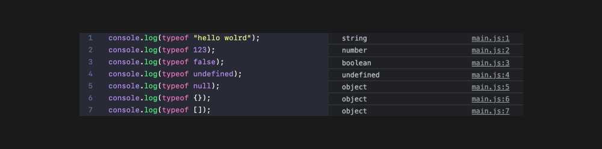
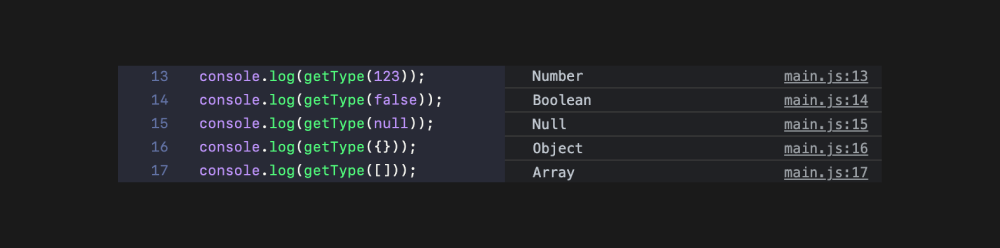

# JS 시작하기

`ECMAScript` : ECMA(에크마)는 자바스크립트를 표준화 해주는 국제 표준화 기구이다. 우리는 JS를 정확하게 표준화된 명칭은 ECMAScript이고, 앞으로 배우는 기본 문법들은 ECMAScript라고 생각하면 된다.

`Java` : 자바와 자바스크립트는 다릅니다. 별개의 프로그래밍 언어입니다.

<br/>

## 데이터 타입 확인

한 줄에 여러가지 명령줄을 작성하는 건 하지말자, 최대한 깔끔하고 일반적인 작성관습(코드 컨벤션)에 따라 작성하는
습관을 들입시다.


`typeof` 키워드를 사용하면 특정 데이터 타입을 알아낼 수 있지만 ` null`,`{} 객체 데이터 ` , `[] 배열데이터`가 object로 타입을 구분하기 힘든 경우도 있다.

**함수로 타입을 구분할 수 있게 작업해보기**



```
function getType(data) {
  return Object.prototype.toString.call(data).slice(8, -1);
}

console.log(getType(123));
console.log(getType(false));
console.log(getType(null));
console.log(getType({}));
console.log(getType([]));

```

- `getType` : `typeof` 대신 쓸 수 있는 별개의 함수를 만들어 동작시킬 수 있다. 이런 직접 작성한 함수는 코딩을 할 때 언제든지 활용할 수 있는 기능이다.

**언제든지 어디서든 활용할 수 있게하기**

- 별도 getType.js 파일 만들어 `export`하기

```

export default function getType(data) {
  return Object.prototype.toString.call(data).slice(8, -1);
}
```

- main.js 최상단에 `import`하기

```
import getType from "./getType";
```

<br/>

## 산술,할당 연산자

- 산술연산자(arithmetic aperator)

  ```
  console.log(1 + 2);
  console.log(5 - 7);
  console.log(3 * 4);
  console.log(10 / 2);
  console.log(7 % 5); // 나머지 연산자
  ```

- 할당연산자(assignment operator)

  ```
  let a = 2;
  // = 이 할당연산자이다. a라는 데이터 2를 할당하는 것
  //아래부터 재할당
  a = a + 2;
  // 더 간소화해서 표현할 수 있다.
  // 산술연산자 5개를 모두 사용할 수 있다.
  a += 2;
  a -= 2;
  a *= 2;
  a /= 2;
  a %= 2;

  ```

<br/>

## 비교,논리 연산자

- **비교연산자(comparison aperator)**

  - 일치연산자 : `===`

  ```
  const a = 1;
  const b = 2;
  //  일치연산자 `===`
  console.log(a === b); // false

  // 함수로 일치연산자 활용하기
  function isEqual(x, y) {
  return x === y;
  }

  console.log(isEqual(1, 1)); //ture
  console.log(isEqual(2, "2")); //"2"는 문자데이터임으로 false
  ```

  - 불일치연산자 : `!==`

  ```
  const a = 1;
  const b = 2;
  //불일치연산자 : `!==`
  //서로가 다른 것인지 확인하는 연산자
  console.log(a !== b); //true
  ```

  - 비교연산자 : `<` ,`>`, `>=`, `<=`

  ```
  const a = 1;
  const b = 2;
  //`<` ,`>`, `>=`, `<=`
  //크거나, 작거나, 크거나같거나, 작거나같거나를 비교하는 연산자
  console.log(a < b); //true
  console.log(a > b); //false
  console.log(a <= b); //true
  console.log(a >= b); //false
  ```

<br/>

- **논리연산자(logical aperator)**

  - and(그리고) 연산자 : `&&`

  ```
    const a = 1 === 1;
    const b = "AB" === "AB";
    const c = true;

    console.log(a); //true
    console.log(b); //true
    console.log(c); //ture

    //and(그리고) 연산자
    //a,b,c가 모두 true인지 비교하는 연산자
    //a,b,c중 하나라도 false가 있으면 false를 출력하는 논리연산자이다.
    console.log("&&:", a && b && c); //&&: true

  ```

  - or(또는) 연산자 : `ㅣㅣ`

  ```
    const a = 1 === 1;
    const b = "AB" === "AB";
    const c = false;

    console.log(a); //true
    console.log(b); //true
    console.log(c); //false

    //or(또는) 연산자 : `ㅣㅣ`
    //or연산자는 모든 값중에 true가 하나라도 있으면 true를 출력하는 논리연산자
    console.log("||:", a || b || c); //||:true

  ```

  - not(부정) 연산자 : `!`

  ```
    const a = 1 === 1;
    const b = "AB" === "AB";
    const c = false;

    console.log(a); //true
    console.log(b); //true
    console.log(c); //false

    //not(부정) 연산자 : `!`
    //반대의 데이터를 반환하는 논리연산자.
    console.log("!:", !a);//!: false

  ```

<br/>

- **삼항 연산자(ternary aperator)**

  ```
  const a = 1 < 2;

  if (a) {
    console.log("참");
  } else {
    console.log("거짓");
  }

  // 위 if문을 삼항연산자로 표현하면 아래와 같다.

  console.log(a ? "참" : "거짓");

  // a라는 값이 true니 false니 "?"
  // true면 1번째를 실행해줘.
  // false면 2번째를 실행해줘.
  // `?`와 `:`을 기준으로 총 3개의 항이 있어 삼항연산자라 부른다.

  ```
