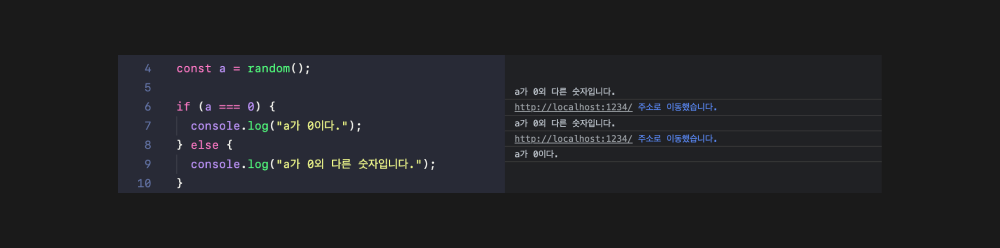
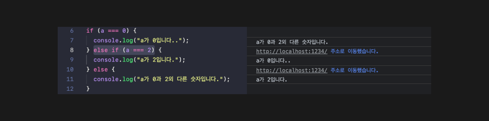
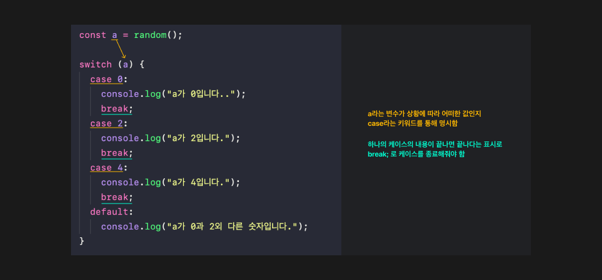
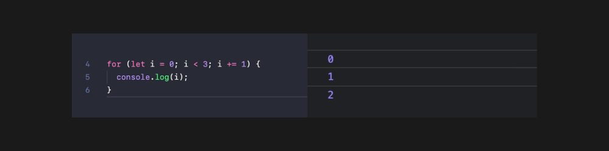

# JS 시작하기

## 조건문

- `if`, `else`

  ```
  // 랜덤하게 숫자를 출력하는 함수
  export default function random() {
    return Math.floor(Math.random() * 10);
  }

  // 조건문으로 출력되는 숫자가 조건에 맞을 때 콘솔에 텍스트로 표기되도록 작성
  const a = random();

  if (a === 0) {
    console.log("a가 0이다.");
  } else {
    console.log("a가 0외 다른 숫자입니다.");
  }
  ```

  

- `else if` 중간 구문으로 추가적인 조건 넣어주기

  ```
    const a = random();

  if (a === 0) {
    console.log("a가 0입니다..");
  } else if (a === 2) {
    console.log("a가 2입니다.");
  } else {
    console.log("a가 0과 2외 다른 숫자입니다.");
  }

  ```

  

  `else if`는 추가적으로 또 넣어줄 수도 있다.

  ```
    const a = random();

  if (a === 0) {
  console.log("a가 0입니다..");
  } else if (a === 2) {
  console.log("a가 2입니다.");
  } else if (a === 4) {
  console.log("a가 4입니다.");
  } else {
  console.log("a가 0과 2외 다른 숫자입니다.");
  }
  ```

- `Switch` (switch statement)

  일반적으로 조건을 통해 내용을 출력하는 것을 분기로 구분해서 나눌 때 기본적으로 `if`문을 쓰지만

  조건의 내용이 **어떤 변수가 특정 값으로 딱 떨어지는 조건으로 분기처리를 하고 있다면** `switch`문이 적합하다.

  ```
  const a = random();

  switch (a) {
    case 0:
      console.log("a가 0입니다..");
      break;
    case 2:
      console.log("a가 2입니다.");
      break;
    case 4:
      console.log("a가 4입니다.");
      break;
    default:
      console.log("a가 0과 2외 다른 숫자입니다.");
  }
  ```

  

<br/>

## 반복문

- `for(시작조건; 종료조건; 변화조건){}`

  ```

  for (let i = 0; i < 3; i += 1) {}
  // let으로 재할당가능한 변수를 정의하고 i라고 이름을 지음
  // 반복문에서 통상적으로 조건에서 사용되는 변수를 i라고 지음(권장함)

  // 시작조건
  // i의 초기값은 숫자데이터 0이다.
  // 종료조건
  // i는 숫자 3보다 작을 때에만 반복한다( 3보다 커지면 종료한다 )
  // 변화조건
  // i += 1 ,i에 1을 더하여 할당한다.

  ```

  

- 반복문 응용하기 (나중에 복습)

  ```
  const ulEl = document.querySelector("ul");

  for (let i = 0; i < 10; i += 1) {
    const li = document.createElement("li");
    li.textContent = `list-${i + 1}`;
    if ((i + 1) % 2 === 0) {
      li.addEventListener("click", function () {
        console.log(li.textContent);
      });
    }
    ulEl.appendChild(li);
  }
  ```

<br/>

## 변수 유효범위(Variable Scope)

- `var`, `let`, `const`

```
  function scope() {
    if (true) { // <--- a라는 변수의 유효범위
      const a = 123;
      console.log(a);
    } //<--- a라는 변수의 유효범위
  }

  scope();
```

`let`과 `const` 는 블록레벨의 유효범위를 가진다.

변수가 선언되어 있는 그 범위의 중괄호`{}`부분이 하나의 블록이고, 이 블록내부에서 유효한 범위를 가질 수 있다.

```
  function scope() { // <--- a라는 변수의 유효범위
    if (true) {
      var a = 123;
    }
  } //<--- a라는 변수의 유효범위

  scope();
```

`var`는 함수레벨의 유효범위를 가져 범위가 더 크다.

때문에 의도하지 않은 범위에서 변수가 사용이 될 수 있고, 그만큼 메모리를 차지하고, 개발자가 확인하지 못하는 메모리 누수로 이어질 위험이 있다.

</br>

## 형 변환(Type conversion)

자료형, 데이터의 타입 중 형이라는 단어만 말한다. 문자, 숫자, 객체등을 데이터 타입이라 한다.

```
  const a = 1;
  const b = "1";

  console.log(a === b); //false

  // 동등연산자
  console.log(a == b); //true
  // 권장하지 않음, 형 변환이 일어나면서 우리가 의도하지 않은 결과가 나올 수 있다.
  // 때문에 `===` 일치연산자를 사용하길 권장한다.
```

- Truthy (참 같은 값)

  - true, {}, [], 1, 2, "false", -12, "3.14" ...

  ```
  if ("false") {
  console.log(123);
  }

  //문자데이터로 "false"라고 했을 때 123이 잘 출력이 됌
  //때문에 이는 true와 같은 개념이라 이해할 수 있다.
  ```

- falsy (거짓 같은 값)

  - false, '', null, undefined, 0, -0, NaN
  - `NaN` : Not a Number `1 + undefined` 라 쳤을 때 `NaN`이 출력된다. 이처럼 숫자 데이터이긴한데, 숫자는 아닐 경우 `NaN`가 출력된다. 숫자와 없는 값을 연산할 경우가 있을 수 있다.

  ```
  if (0) {
  console.log(123);
  }

  //123이 잘 출력되지 않는다.
  //false로 해석할 수 있다.
  ```

  JS의 큰 특징 중 하나. 작성한 특정한 데이터들이 **형 변환**을 통해 거짓의 값으로 해석될 수도, 참의 값으로 해석될 수도 있다.
