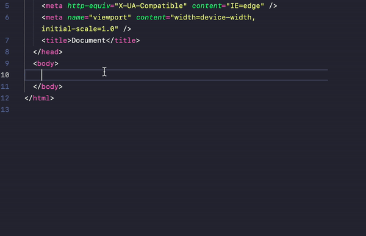

# Start-02 : VS Code 사용법

- **프로젝트 단위**는 폴더 (디렉토리)
- 단축키 설정 : 최상단 code -> 기본설정 -> 바로가기 키에서 설정가능
- 추천익스텐션 : `Beautify` `Auto Rename Tag`
- 몰랐던 단축키 : `cmd`+`\` 화면분활 / `cmd`+`b` 디렉토리 바 온오프

```
꺽쇠괄호로 감싼 것을 태그라한다.
<div> : 열린태그
</div> : 닫힌태그

```

<br>
<br>

# Start-03 : 또 html/css/js

## 상대 경로와 절대 경로

#### **상대 경로**

- `./` : 내 주변을 뜻함
- `../`: 상위 폴더를 뜻함

#### **절대 경로**

- `http` : 원격
- `/`: 최상위 경로

<br>
<br>

# Start-04 : 기초 꿀 팁들

### 스타일 초기화

- [reset-css-cdn](https://www.jsdelivr.com/package/npm/reset-css) : 절대경로로 head에 넣으면 css가 스타일이 초기화된다.

### emmet


이미지 처럼 간단한 타이핑만으로 태그가 적용되는 것을 말한다.
Emmet은 css선택자를 활용해 사용하는 기능이다.

<br>
<br>
<br>
<br>

---

## 챕터 2,3,4

모두 기본 셋팅과 기초에대한 내용이여서 빠르게 스킵하면서 들었다.
이 와중에도 몰랐던 팁들이 있어 유용했지만 빠르게 넘어가자...!!!!
