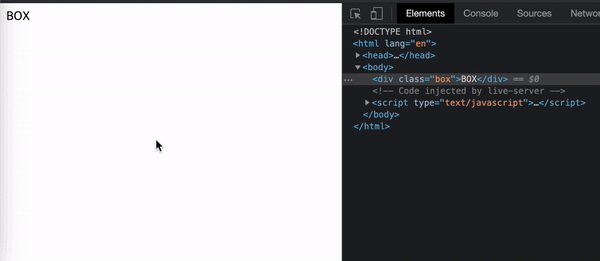
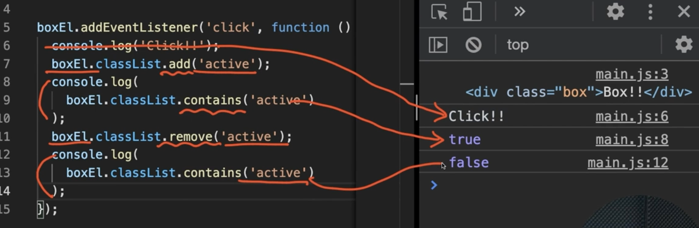
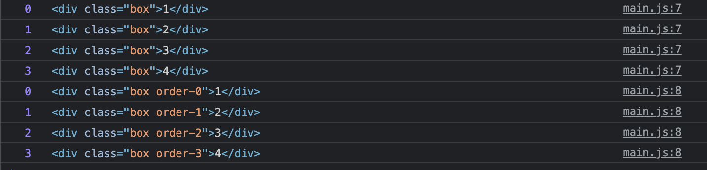
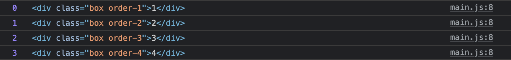
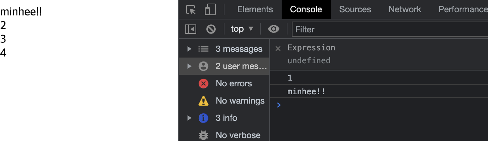

# Start-09 : JS

- [자바스크립트 데이터 종류 정리](https://github.com/minheeyoon/TIL-eternity/blob/master/JavaScript/TIL0102_JS%EA%B8%B0%EC%B4%88_%EB%8D%B0%EC%9D%B4%ED%84%B0%ED%83%80%EC%9E%85/01_JS%EA%B8%B0%EC%B4%88%EC%A0%95%EB%A6%AC.md)

## 함수 function

- [자바스크립트 함수 정리](https://github.com/minheeyoon/TIL-eternity/blob/master/JavaScript/TIL0208_%ED%95%A8%EC%88%98%EC%84%A0%EC%96%B8%EA%B3%BC%ED%91%9C%ED%98%84/04_%ED%95%A8%EC%88%98%EC%9D%98%EC%84%A0%EC%96%B8%EA%B3%BC%ED%91%9C%ED%98%84.md)

명령들을 감싸고있는 하나의 집합

```
// 함수선언
function hellowMinhee() {
  // 실행코드
  console.log(1234);
}
// 함수호출
hellowMinhee();
```

<br>
<br>
함수안에서 특정 값을 반환할 수 있다.

```
function hellowMinhee() {
  return 123;
}

let a = hellowMinhee();

console.log(a);
```

- 함수에서는 `return`이라는 키워드를 사용해서 자바스크립트 데이터를 함수 밖으로 내보낼 수 있고, 이 내보낸 값을 **변수에 할당 할 수 있다.**

<br>
<br>

함수선언

```
// a와 b는 매개변수 (파라미터 Parameters)
function sum(a, b) {
  return a + b ;
}

//재사용
let a = sum(1, 2); // 1과 2는 인수(아규먼츠 Arguments)
let b = sum(7, 12);
let c = sum(2, 4);

console.log(a, b, c);
```

- 함수가 호출되는 부분에 데이터를 집어넣을 수 있고 `let a = sum(1, 2); ` 이 집어넣은 데이터를 받아줄 변수를 소괄호 안에 정의할 수 있다 `function sum(a, b)`

<br>
<br>

기명, 익명 함수

```
// 기명 , 이름있는 함수
// 함수 선언
function hello(){
  console.log('hi');
}

// 익명 , 이름없는 함수
// 변수에 할당해서 표현
let world = function (){
  console.log('hello');
}

// 함수 호출
hello();
world();
```

```
//객체 데이터
const minhee = {
  name: 'minhee',
  age : 940511,

  //메소드(Method)
  //속성부분에 함수가 할당되어 있으면 메소드로 부른다.
  getName: function(){
    return this.name;
  }
}

// 호출
const hisName = minhee.getName();
console.log(hisName);
//또는
console.log(minhee.getName());
```

# DOM API

**D**ocument **O**bject **M**odel **A**pplication **P**rogramming **I**nterface

- DOM : html에 들어있는 여러가지 오브젝트 모델(div,span,input)
- API : 애플리케이션이 동작하기 위해서 입력하는 프로그래밍 명령
- 자바스크립트에서 HTML을 제어하는 여러가지 명령들

```
//html
<div class="box">BOX</div>
```

```
//JS
let boxEL = document.querySelector('.box');
console.log(boxEL);
```


**defer**

`head`에서 js파일을 연결하는 경우 html문서를 다 읽지않고 js파일을 먼저 읽어버려서 사이트에 표기가 안되는 경우가 있다.

그래서 대부분 강의에서는 `body`태그 최 하단에 js파일을 위치시키게 하는 경우가 많은데 해당 강의에서는 스크립트 태그(정보)를 구조부분에 위치시킨다는게 꺼리짐하다는 입장.

```
<script defer src="./main.js"></script>
```

`defer`를 사용하면 html문서를 다 읽은상태로 다시 js를 실행하겠다~라는 의미를 부여해줄 수 있다.
<br>
<br>

### 브라우저에서 정의되어 있는 메소드 활용해보기

<br>
<br>

**html 요소 (Element) 1개 검색/찾기**

```
let boxEL = document.querySelector('.box');
```

`querySelector`: 선택자를 통해서 찾을 수 있는 여러요소 중 가장 먼저 찾은 요소 1개만 반환한다.

<br>

**addEventListener**

```
boxEl.addEventListener();
```

```
//인수 추가 가능
boxEl.addEventListener(1,2);
```

```
//1 - 이벤트(Event, 상황)
boxEl.addEventListener('click',2);
```

```
//2 - 핸들러(handler, 실행할 함수)
boxEl.addEventListener('click',function(){
  console.log('Click!!!');
});
```

- body에서 찾은 boxEl에 일어나는 이벤트를 들어볼건데(addEventListener) 그 이벤트는 `click`이고 누군가가 `click`하면 이 익명의 함수`function()~`를 실행할게요.

- ```
      boxEL.addEventListener('click',function(){
      console.log("click했구나?!")
    });
  ```
  

<br>
<br>

**classList**

요소의 클래스 정보 객체 활용

- html의 class라는 전역속성에 대한 정보를 가지고있는 특정 객체를 활용하는 것

`add`

```
boxEL.classList.add('active');

// box라는 클래스요소에 active라는 클래스를 add하겠다.

let isContains = boxEL.classList.contains('active');

// contains (포함되어있니?) - box라는 클래스요소에 adtive라는 클래스가 포함되어있니? - 이 반환된 값이 let isContains 라는 변수에 할당된다.

console.log(isContains); // true
```


<br>
<br>

`remove`

```
boxEL.classList.remove('active');

// box라는 클래스요소에 active라는 클래스를 remove하겠다.

let isContains = boxEL.classList.contains('active');

// contains (포함되어있니?) - box라는 클래스요소에 adtive라는 클래스가 포함되어있니? - 이 반환된 값이 let isContains 라는 변수에 할당된다.

console.log(isContains); // false

```


<br/>
<br/>

## 응용해보자

```
boxEL.addEventListener('click',function(){
  console.log("click했구나?!")
  boxEL.classList.add('active');
});
```

콘솔에는 변화가 없지만 html의 클래스에 active가 생기는걸 확인할 수 있다.


```
boxEL.addEventListener('click',function(){
  console.log("click했구나?!")
  boxEL.classList.add('active');
  console.log(
    boxEL.classList.contains('active')
    );
    boxEL.classList.remove('active');
    console.log(
      boxEL.classList.contains('active')
    );
});
```

각각의 코드들이 잘 적용되는 모습을 확인할 수 있다.
(이미지만들기 귀찮아서 캡쳐가져옴...)


<br/>
<br/>

**querySelectorAll**

```
//HTML 요소 모두 검색/찾기
const boxEls = document.querySelectorAll('.box');
console.log(boxEls);
```

`.box`클래스를 가진 요소를 하나만 찾는 것과 모두 같이 찾는것은 어떤게 다를지 체크해보자.

```
// 01
// 찾은 요소들 반복해서 함수 실행
// 익명 함수를 인수로 추가

baxEls.forEach(function () {});


// 02
//첫 번째 매개변수(boxEl) : 반복 중인 요소 - 이름지을 수 있음
// 두 번째 매개변수(index) : 반복 중인 번호 - 통상적으로 인덱스라 함

boxEls.forEach(function (boxEl, index) {});

// 03 출력

boxEls.forEach(function (boxEl, index) {
  boxEl.classList.add(`order-${index + 1});
  console.log(index, boxEl);

```



- `.box` 클래스의 갯수를 잘 찾아내는 모습
- ```
  function(boxEl, index) {
      boxEl.classList.add(`order-${index}`);
      console.log(index, boxEl);
    }
  ```

  를 통해 클래스에 `order-`가 추가된 모습을 확인할 수 있다.

- ```
    function(boxEl, index) {
        boxEl.classList.add(`order-${index + 1 }`);
        console.log(index, boxEl);
      }
  ```
  
  - `${index + 1 }` 을 통해서 넘버링이 1부터 시작하게 만들수 있다.

<br/>
<br/>

**textContent**

문자데이터를 제어해보자.

```
const boxElㄴ = document.querySelector('.box');

// Getter, 값을 얻는 용도
console.log(boxEl.textContent);

//Setter, 값을 지정하는 용도
boxEl.textContent = 'minhee?!';
console.log(bexEl.textContent);
```



```
  <body>
    <div class="box">1</div>
    <div class="box">2</div>
    <div class="box">3</div>
    <div class="box">4</div>
  </body>
```

- 첫번째 box div의 문자가 1이지만 `boxEl.textContent = 'minhee?!';` 을 지정하자 minhee!!가 노출되는 모습

<br/>
<br/>

## 메소드 체이닝

```
const a = 'minhee';

// split : 문자를 인수 기준으로 쪼개서 배열로 반환
// reverse : 배열을 뒤집기
//  joun : 배열을 인수 기준으로 문자로 병합해 반환
const b = asplit('').reverse().join(''); // 메소드체이닝

console.log(a);
console.log(b);
```

위와같이 `const b = asplit('').reverse().join('');` 메소드가 체인처럼 엮여있는 것을 말한다.

- 우리가 쓸 수 있는 메소드들은 위 체인처럼 붙여 쓸 수 있다.

---

JS로 넘어오니 확실히 재밌다!

- 개념적인 것 보다 실용적인것 부터 접근해서 그런지 아직까지는 머리아플 만큼 어려운 건 없는 것 같음 (메소드, 함수, 매개변수 같은 이름이 나오면 약간 아프긴하다...)

- 용어가 어렵다. 왜 메소드인가? 왜 매개변수인가 이유가 다 있는데 머리가 못따라가고 있다.

- 다음은 사이트 하나를 만들어보는 건데... 고스라니 따라히긴 싫으니 디자인을 해볼까 생각중... 뭔가 없으려나...
