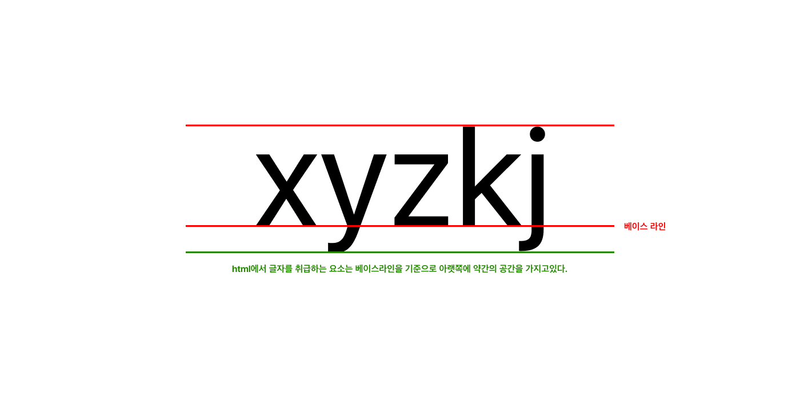

# Start-10 : 예제 응요하며 유용한 정보 정리

### [오픈 그래프 - The Open Graph protocol](https://ogp.me/)

- 공유됐을 때 우선적으로 활용되는 정보 지정

```
<meta property="og:type" content="" />
<meta property="og:site_name" content="" />
<meta property="og:title" content="" />
<meta property="og:description" content="" />
<meta property="og:image" content="" />
<meta property="og:url" content="" />
```

- `og:type`: 페이지의 유형(E.g, website, video.movie)
- `og:site_name`: 속한 사이트의 이름
- `og:title`: 페이지의 이름(제목)
- `og:description`: 페이지의 간단한 설명
- `og:image`: 페이지의 대표 이미지 주소(URL)
- `og:url`: 페이지 주소(URL)

### [트위터 카드](https://developer.twitter.com/en/docs/twitter-for-websites/cards/guides/getting-started)

```

<meta property="twitter:card" content="" />
<meta property="twitter:site" content="" />
<meta property="twitter:title" content="" />
<meta property="twitter:description" content="" />
<meta property="twitter:image" content="" />
<meta property="twitter:url" content="" />

```

- `twitter:card`: 페이지(카드)의 유형(E.g. summary, player)
- `twitter:site`: 속한 사이트의 이름
- `twitter:title`: 페이지의 이름(제목)
- `twitter:description`: 페이지의 간단한 설명
- `twitter:image`: 페이지의 대표 이미지 주소(URL)
- `twitter:url`: 페이지 주소(URL)

### inline ele

`a`, `img`, `span`, `srong`, `input`, `textarea`, `select`...

인라인 요소는 가로, 세로 값을 가질 수 없고 마진과 패딩의 위 아래 값을 가질 수 없다.

결국에는 글자를 다루는 요소를 다루는 것이 인라인 태그이다.



이런 현상은 html/css가 화면 레이아웃을 꾸미기 위함이 아니라 문서를 위해 만들어진 것이기 때문에 발생한다.

```
tag {
  display: block;
}
```

이 인라인 요소를 하나의 블럭으로 취급하겠다고 작성해주면 해결된다.
