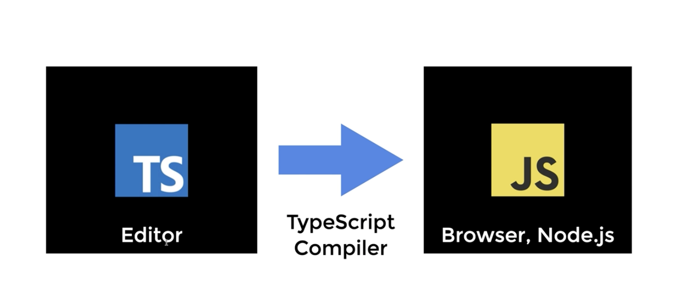
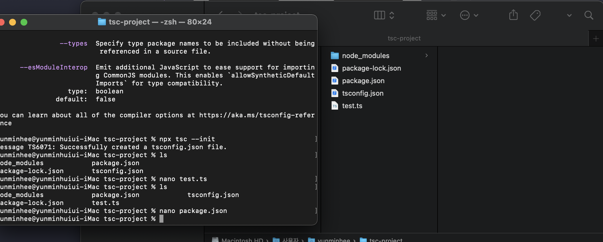

# TypeScript 란 무엇인가

[TypeScript 공식홈페이지](https://www.typescriptlang.org/)

Typed JavaScript : 우리가 사용하는 자바스크립트에 타입이라는 개념을 적용시킨 것

- 자바스크립트에 타입을 추가해서 자바스크립트를 확장시킨다.
- 자바스크립트를 이해함으로 코드를 실행하기 전, 에러를 잡거나 코드를 고치는데 시간을 절약시켜줍니다.
- 어떤 OS나 브라우저, 자바스크립트 실행환경을 지원한다. 모두 오픈소스이다.

TypeScript = Language 다.

- 자바스크립트의 기능을 강화시킨다.
- compiles , 순수 자바스크립트로 컴파일 해준다.
- 자바스크립트는 `interpreted language`이다.

`Compiled`

- 컴파일이 필요 O
- 컴파일러가 필요 O
- 컴파일하는 시점 O
  - => 컴파일 타임
- 컴파일된 결과물을 실행
- 컴파일된 결과물을 실행하는 시점

`Interpreted`

- 컴파일 필요 X
- 컴파일러 필요 X
- 컴파일하는 시점 X
- 코드 자체를 실행
- 코드를 실행하는 시점 O
  - = 런타임

 
 

# TypeScript 설치

node.js

- 크롬의 v8 JavaScript Engine을 사용하여, 자바스크립트를 해석하고, OS레벨에서의 API를 제공하는 서버사이드 용, 자바스크립트 런타임 환경

npm

- 패키지, 다른 외부 라이브러리를 설치할 수 있도록 도와주는 관리형 프로그램

Visual Studio Plugin 설치

- 비쥬얼 스튜디오 2017 / 2015 업데이트 3 이후로는 디폴트로 설치되어 있음

하지만 npm으로 설치하는 것을 권장함

`npm i typescript -g`

설치 후 잘 작동되는 지 확인 , 위와 같이 뜬다면 잘 실행된다는 의미

### 프로젝트 안에서만 설치하는 법

` mkdir tsc-project`로 폴더만들고`cd tsc-project `들어가서
`npm init -y` 로 설치 `npm i typescript`

실행방법

`node_modules/.bin/tsc`
`node_modules/typescript/bin/tsc`
`npx tsc` <- 제일 짧아서 가장 많이 쓰임

