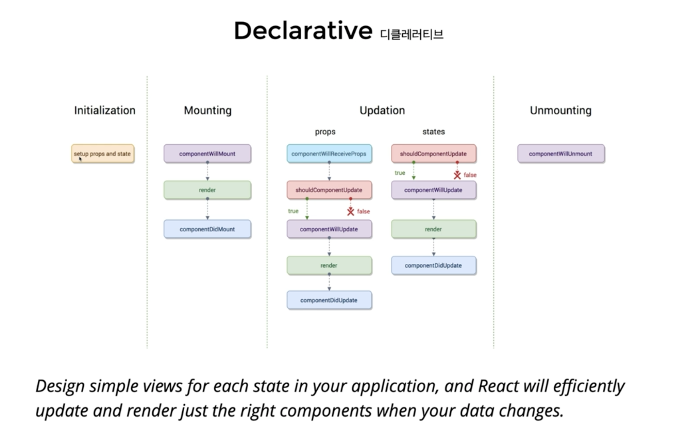
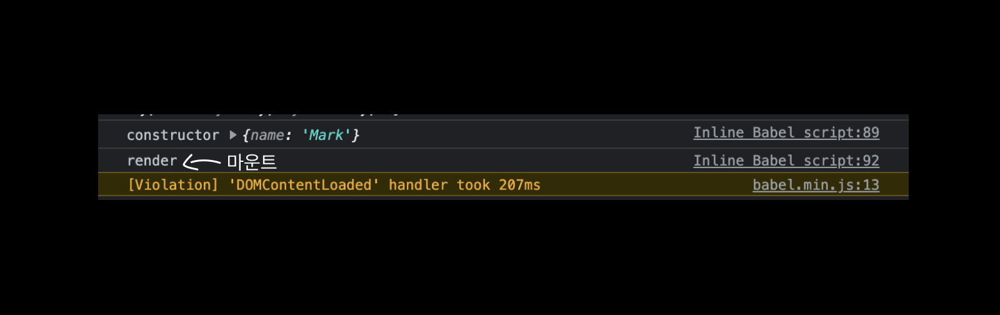

# Event Handling

- html Dom에 클릭같은 이벤트가 발생하면, 그에맞는 변경이 일어나야하는데 JSX에 이벤트를 설정해줄 수 있다.

- camelCase로만 사용가능합니다

  - onClick, onMouseEnter

- 이벤트에 연결된 자바스크립트 코드는 함수입니다.

  - 이벤트 = {함수} 와 같이 씁니다.

- 실제 DOM요소들에만 사용 가능합니다.

  - 리액트 컴포넌트에 사용하면, 그냥 props로 전달합니다.

# Component Liftcycle

리액트 컴포넌트가 탄생부터 죽음까지 여러지점에서 개발자가 작업이 가능하도록 메서드를
오버라이딩 할 수 있게 해준다.



- Declarative 디클레러티브: 탄생과 죽음까지 여러가지 순간을 선언적으로 표현해놓으면 , 리액트 컴포넌트가 해당 상황이 되면 선언적으로 표현된 함수들을 실행해서 사용할 수 있게 해줌

### Component 생성 및 마운트

최초에 Class Component가 인스턴스가 되고 이것을 브라우저 어딘가에 표현될 때를 마운트라고 부른다.

constructor - componentWillMount - **render(최초랜더)** - componentDidMount

최초로 render될 때를 마운트라 본다.

이 과정을 코드로 살펴보자.

```

 class App extends React.Component {
        state = {
          age: 39,
        };

        constructor(props) {
          super(props);
          console.log("constructor", props);
        }
        render() {
          console.log("render");
          return (
            <div>
              <h2>
                Hellow {this.props.name} - {this.state.age}
              </h2>
            </div>
          );
        }
      }

      ReactDOM.render(<App name="Mark" />, document.querySelector("#root"));

```

- 라이프 사이클 예제는 대부분 잘 실행이 안됐기 때문에 별도로 공부해보기

  [리액트 사이트 공식문서](https://reactjs.org/docs/state-and-lifecycle.html)
  [벨로퍼트님 블로그 글 ](https://react.vlpt.us/basic/25-lifecycle.html)


