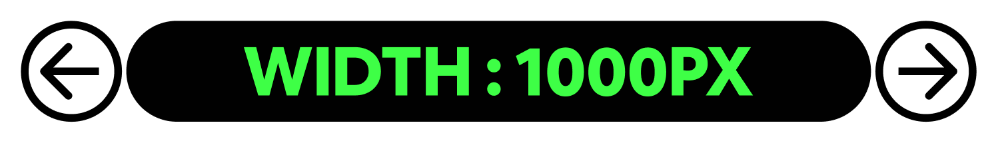
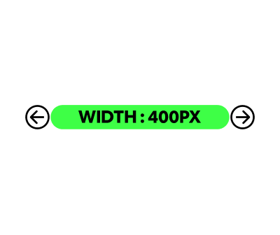

# TIL 작성규칙 : HTML

**<span style="color:#4886FF">TITLE</span>** : TIL{Date}_{lowerCamelCase}


**<span style="color:#4886FF">FORM👇</span>** 

```
오늘 배운 것 한 줄 정리 
```

### **EX시도한 것**



```
ASIS CODE
```

```
TOBE CODE : 있다면 반드시 기록할 것 !
```

<p align="center">
  
  
  *이미지 첨부 시 참고*
</p>
---

### **Reference**
<a href="https://www.notion.so/miniyoon/Minhee-Yoon-deca2ff59d4345119eed55b1ecb2d53a">
</a>

<a href="">
</a>

<a href="">
</a>

[아이콘참고 ~~작성 시 지울 것~~ ](https://simpleicons.org/)
