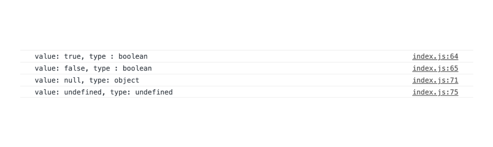
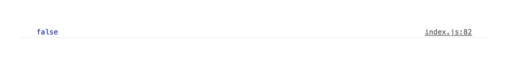
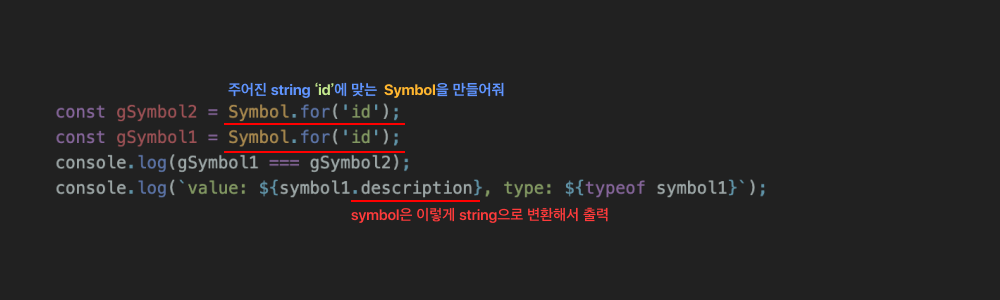
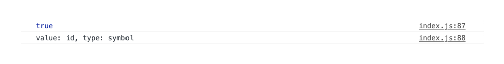
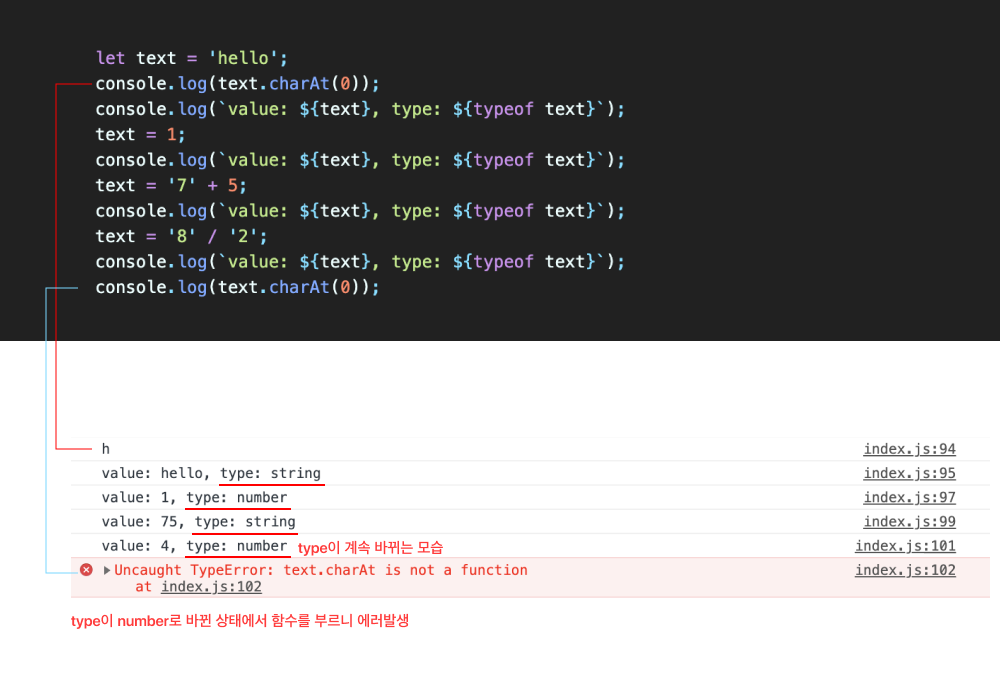

# 01_JavaScript기초정리 

**<span style="color:#4886FF">TITLE</span> : JavaScript기초 복습**

**<span style="color:#4886FF">목차</span>**

- [01-01. Console](##01-01.Console) & [01-02. use strict](##01-02.useStrict)
- [02-01. Variable 변수 ](##02-01.Variable)
- [02-02. Constant 상수 ](##02-02.Constant)
- [02-03. Variable Types ](##02-03.VariableTypes)
- [03. Dynamic typing ](##03.DynamicTyping)


## **01-01.Console**

`Console API` : Console API(Application Programming Interface)는 WEB API의 하나로 **브라우저**가 제공하는 , **브라우저**가 이해할 수 있는 함수들이다.

[ 🔗 Console API MDN Link ](https://console.spec.whatwg.org/)

```
console.log('Hello World')
```


<br>
<br>


## **01-02.useStrict**

자바스크립트는 굉장히 유연한 언어이기 때문에, 개발자가 많은 실수를 할 수 있다.

자바스크립트에서는 선언되지 않는 변수의 값을 할당하거나, 기존의 프로토타입을 변경할 수 있는데, 

``` 'use strict'; ``` 를 사용하게 되면 위와 같은 것을 사용할 수 없게된다.

```
'use strict';
```

- 장점 : 조금 더 상식적인 범위 안에서 자바스크립트를 사용할 수 있고, 자바스크립트 엔진이 조금 더  효율적으로 빠르게 분석할 수 있기 때문에 실행하는데 있어서 더 나은 성능을 기대할 수 있다.


<br>
<br>


## **02-01.Variable**

자바스크립트에서 변수를 선언할 수 있는 키워드 

-  **`let`** : added in ES6 
-  `var` : 값을 선언하기도 전에 사용할 수 있어서 지양하는게 좋다. 


### **Block Scope**

```
{
  let minhee = 'name';
  console.log(minhee);
  minhee = 'hello';
  console.log(minhee);
}
```

<br>
<br>


## **02-02.Constant**
한 번 할당하면 값이 바뀌지 않는 것 

- **`const`** : 변경되지 않아야 할 값에는 const를 사용하는 것이 좋다.

<br>
<br>

## **02-03.VariableTypes**

자바스크립트 데이터 타입에는 어떤 것이 있는지 알아보자.
- primitive type (single item) : number, string, boolean, null, undefinedn, symbol 
- object : box container 
- function : first-class function

<br>

### **primitive type**
- **`number`** 

  ```
  const count = 17; // 정수 
  const size = 19.2; // 소수 

  console.log(`value: ${count}, type: ${typeof count}`);
  console.log(`value: ${size}, type: ${typeof size}`);

  const nAn = 'not a number' / 2; 
  const testConsoleA = 1 / 0;
  const testConsoleB = -1 / 0;

  console.log(nAn);
  console.log(testConsoleA);
  console.log(testConsoleB);
  ```


   위 코드를 실행 했을 때 콘솔창에 나타나는 출력 값.


  - 소수와 정수도 number type으로 나타난다. 
  - 숫자가 아닌것을 숫자로 나누었을 때 Not a Number , NaN이 출력된다.
  - 무한히 나누어지는 값은 infinity 로 출력된다. 
  - 음수로 나누어지는 것은 -infinity 로 출력된다.
  
<br>


- **`string`** 
  ```
  const char = 'c'; 
  const apple = 'apple'; 
  const greeting ='hello' + apple;

  console.log(`value: ${greeting}, type: ${typeof greeting}`);

  const helloJuni = `hi ${apple}!`; //template literals (string)
  console.log(`value: ${helloJuni}, type: ${typeof helloJuni}`);
  ```
  - template literals (string) : ``을 이용해서 간편하게 string을 만들 수 있다. 이를 사용하지 않고는 하단처럼 표현하면 된다.
  ```
  console.log('value: '+ helloJuni + 'type: ' + typeof hellJuni)
  ```
<br>

- **`boolean`**

  참과 거짓 (false / true)
  
  `flase` : 0 , null, undefined, NaN, ''  
  `true` : any other value 

  ```
    const canRead = true;
    const testFse = 3 < 1; //flase
    
    console.log(`value: ${canRead}, type : ${typeof canRead}`);
    console.log(`value: ${testFse}, type : &{typeof testFse}`);

   //null
   let nothing = null;
   console.log(`value: ${nothing}, type: ${typeof nothing}`);
   
  //undefined
   let x;
   console.log(`value: ${x}, type: ${typeof x}`);

  ```
  위 코드를 실행 했을 때 콘솔창에 나타나는 출력 값.
  
  - true라는 값을 바로 할당가능하다.
  - 3 < 1 같은 값도 평가가 되어 flase로 출력된다. 
  - null : 내가 명확하게 너는 텅텅비어 있는 값이야, 라고 지정해주는 것 
  - undefined : 선언은 되었지만 아무것도 정해지지 않은 상태. 아무런 값이 할당되지 않은 상태도 undefined으로 출력된다. 


<br>

- **`symbol`**

  동시다발적으로 일어날 수 있는 코드에서 우선순위를 주고싶을 때 **고유한 식별자**가 필요할 때 쓰여진다. 

  ```
  const symbol1 = Symbol('id');
  const symbol2 = Symbol('id');
  console.log(symbol1 === symbol2);
  ```
  - 동일한 string으로 심볼을 만들었지만 두 가지의 심볼은 다른 경우다.
  위 코드를 실행 했을 때 콘솔창에 나타나는 출력 값.

  <br>

  string이 똑같고, 동일한 symbol을 만들고 싶다면?
  ```
  const gSymbol2 = Symbol.for('id');
  const gSymbol1 = Symbol.for('id');
  console.log(gSymbol1 === gSymbol2);
  console.log(`value: ${symbol1.description}, type: ${typeof symbol1}`);  
  ```
  

  위 코드를 실행 했을 때 콘솔창에 나타나는 출력 값.

  <br>

- **`object`**

  우리가 일상생활에서 보는 물건과 물체들을 대표할 수 있는 박스형태를 말한다.
  
  ```
  const itzy = {
    name : '잇지',
    member : 6
  };
  ```
  
  - itzy는 const로 지정되어 있어서 한번 할당된 object는 다른 obejct로 변경이 불가하다.
  - 하지만 itzy object안에 `name` 과 `member`라는 변수는 다른 값으로 할당이 가능하다.
  ```
  //EX
  itzy.name = '있지';
  ```


<br>
<br>

## **03.DynamicTyping**

JavaScript는 선언할 때 어떤 타입인지 선언하지 않고, 프로그램이 동작할 때 할당된 값에 따라 타입이 변경될 수 있다는 걸 뜻한다. 

좋은 아이디어가 있을 때 정말 유연하게 쓸 수 있는 언어지만 다수의 엔지니어들이 협업할 때 문제가 있다.

```
let text = 'hello';
console.log(text.charAt(0));
console.log(`value: ${text}, type: ${typeof text}`);
text = 1;
console.log(`value: ${text}, type: ${typeof text}`);
text = '7' + 5;
console.log(`value: ${text}, type: ${typeof text}`);
text = '8' / '2';
console.log(`value: ${text}, type: ${typeof text}`);
console.log(text.charAt(0));
```
  
  
  - 위와 같은 경우들로 에러가 발생하는 경우가 많다.
  - 때문에 나온 것이 TS(TypeScript)


<br>
<br>


## 새롭게 알게 된 것

데이터 타입들에 대해서 조금 더 자세히 집고 넘어가는 것 같다. 

자바스크립트라는 언어 자체를 더 이해한 계기가 되었다. 

이 친구의 성격이나 개발자들이 const와 let을 왜 잘 구분해서 적으려고 하는지도 이해할 수 있게 되었다.

var를 왜 사용하면 안되는지도 알게됐다.


## 여전히 막연한 것 

언어를 이해하는 것과 잘 쓰는 것은 또 다른 문제이다. 여전히 콘솔은 찍는 게 어렵고, 

데이터 타입들을 어떻게 써봐야지? 같은 구체적인 공부방법들이 하나도 생각나지 않는다. 

30분짜리 한 강의를 듣는데 3시간이 넘는 시간을 들였다. 

빨리 실력을 늘리고 싶은데, 들여지는 시간들에 비해 결과물을 내보일 게 없어 초조하다. 

---

### **Reference**
<a href="https://www.youtube.com/playlist?list=PLv2d7VI9OotTVOL4QmPfvJWPJvkmv6h-2">
</a>
