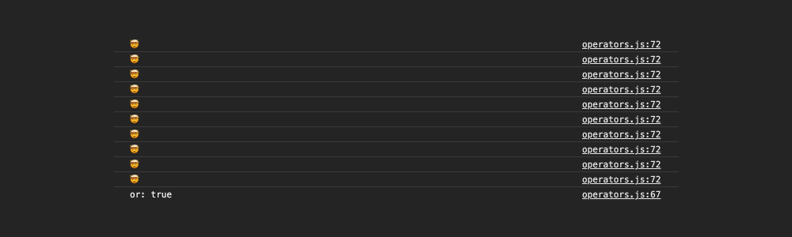
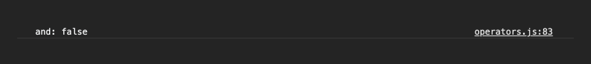

# 02_연산과 반복문

**<span style="color:#4886FF">TITLE</span> : 연산과 반복문**

**<span style="color:#4886FF">목차</span>**
- 01.Operators
  - [String_Concatenation](##**String_Concatenation**)
  - [Numeric_operators](##**Numeric_operators**)
  - [ ++,-- operators](##**++,--operators**)
  - [ = operators](##**=operators**)
  - [ <= operators](##**<=operators**)
  - [ Logical operators ](##**Logical_operators**)


<br>
<br>

## **String_Concatenation**
```
console.log('my' + 'cat'); 
// 문자열과 문자열 합해서 새로운 문자열을 만듬

console.log('1' + 2);
// 문자열에 숫자를 더하면 숫자가 문자열로 변환되서 합해짐

console.log(`string literals: 1+2 = ${1 + 2}`);
// 백팁 기호를 활용해서 string literals를 만들 수 있다. 
// $를 이용하면 변수값을 계산해서 string으로 포함해서 문자열로 만들게 된다.

//-------------------------------------

console.log("mini's \nnote");
console.log('mini\'s note');
// \n 줄바꿈 과 \로 기호 표기해주기 

```

<br>

## **Numeric_operators**
```
console.log(1 + 1); // add
console.log(1 - 1); // substract 
console.log(1 / 1); // divide
console.log(1 * 1); // multiply 
console.log(5 % 2); // remainder 나누고 나머지 값 
console.log(2 ** 3); // exponentiation 2의 3승 
```
<br>

## **++,--operators**

Increment and decrement operators (증가 및 감소 연산자)

값을 하나씩 증가하거나 감소하거나.

```
let counter = 2;
const preIncrement = ++counter; //앞에 붙으면 바로 업데이트되어 할당

// 위 코드는 아래 주석 처리된 코드와 동일하다.
// counter = counter + 1; 
// preIncrement = counter;

console.log(`preIncrement: ${preIncrement}, counter: ${counter}`);

const postIncrement = counter++; //뒤에 붙으면 할당한 후 업데이트

// 위 코드는 아래 주석 처리된 코드와 동일하다.
// preIncrement = counter;
// counter = counter + 1; 

console.log(`postIncrement: ${postIncrement}, counter: ${counter}`);

```
 - **--** 도 동일하다.

<br>

## **=operators**

할당하는 operators

```
let x = 3;
let y = 6;
x += y; // x = x + y;
x -= y; 
x *= y;
x /= y;
```

[ 🔗 할당연산자 MDN Link ](https://developer.mozilla.org/ko/docs/Web/JavaScript/Reference/Operators/Assignment_Operators)


<br>

## **<=operators**

비교하는 operators

```
console.log(10 < 6); // less than 작거나 
console.log(10 <= 6); // less than or equal 작거나 같거나 
console.log(10 > 6); // greater than 크거나 
console.log(10 >= 6); // greater than or equal 크거나 같거나 
```
<br>

## **Logical_operators**
- `||`  or  
- `&&`  and  
- `!`  not

```
// || (or) 예제 

const value1 = false;
const value2 = 4 < 2;

console.log(`or: ${value1 || value2 || check()}`);
// 위 세가지 중에 하나라도 true가 되는 아이가 있으면 true로 계산되는 연산자.

function check() {
  for (let i = 0; i < 10; i++) {
    // wasting time
    console.log('🤯');
  }
  return true;
}
```
  
  
- `check`와 같이 연산을 많이하는 함수를 호출하는 아이를 마지막에 배치하는 것이 효율적이다.

<br>

```
// &&(and) 예제 

const value1 = false;
const value2 = 4 < 2;

console.log(`and: ${value1 && value2 && check()}`);
// 위 세가지가 모두 true가 되야지 true를 리턴하는 아이

function check() {
  for (let i = 0; i < 10; i++) {
    // wasting time
    console.log('🤯');
  }
  return true;
}
```
  
  
  - `value1 `이 false이기 때문에 flase를 노출하고 뒤 코드는 더 읽지 않음.

  <br>

  ```
// !(not) 예제 

const value1 = false;
const value2 = 4 < 2;

console.log(!value1);
// 값을 반대로 바꿔주는 연산자, value1은 true로 바꾸어줌 
```


# Equality Operators 는 다음시간에 

---

### **Reference**
<a href="https://www.youtube.com/playlist?list=PLv2d7VI9OotTVOL4QmPfvJWPJvkmv6h-2">
</a>
