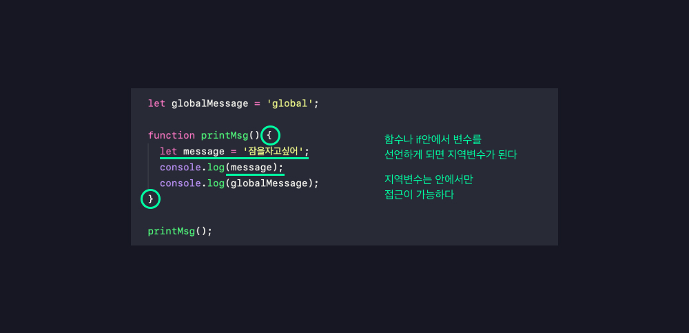
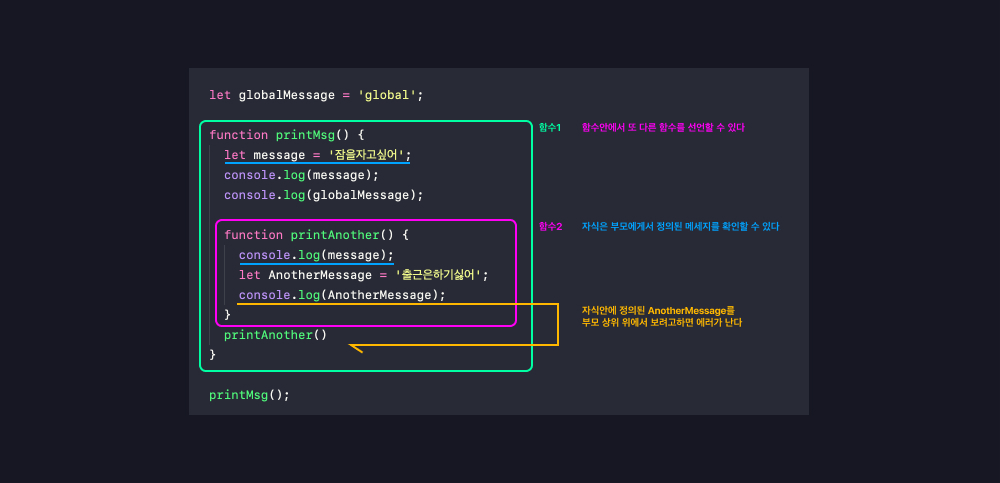

# 04_함수의선언과 표현

**<span style="color:#4886FF">TITLE</span> : 함수의선언과 표현**

**<span style="color:#4886FF">목차</span>**

- [01.function](##01.funtion)
- [02.Parameters](##02.Parameters)
- [03.Default Parameters](##03.DefaultParameters)
- [04.Rest Parameters](##04.RestParameters)
- [05.Local scope](##05.Localscope)
- [06.Return](##06.Return)
- [07.Early Return](##07.EarlyReturn)
- [08.Function Expression](##08.FunctionExpression)
- [09.Callback hell](##09.Callbackhell)
- [10.Arrow Function](##10.ArrowFunction)
- [11.IIFE](##11.IIFE)

<br>
<br>


## **01.function**

프로그램안에서 각각 저마다의 기능을 수행하는 함수들이 존재한다.

프로그램안에서 각각의 작은 단위를 수행하는 것이 Function이다.


  
input(parameter) 를 받아서 이것들을 잘 처리한 후 
output(literal) 하는 것이 바로 Function이다. 

언어 자체의 존재하는 funtion들을 쓸 때 ,API (Application Programming Interface)를 쓸 때 
함수의 이름을 보고 이 함수는 이런 일을 하겠구나 생각할 수 있다. 

전달해야하는 parameter들이 무엇인지 어떤 값이 Return되길 기대할 수 있는지 이런 인터페이스를 보고 
예상할 수 있다.

그래서 함수에는 input과 output이 중요하고 
함수이름을 잘 정하는 것이 중요하다.

**선언하는 법**
```
function name(param1, param2){body...return;}
// 펑션 키워드를 이용하고 함수이름을 지정하고(파라미터를 나열하고){함수안에 기본적인 비즈니스 로직을 작성하고 리턴해준다.}
```
- 하나의 함수는 한 가지 일만 하도록 해야한다.
- 함수는 무언가를 동작하는 것이기 때문에 doSometing, command, verb 동사형태로 이름을 지정해야한다.
- JS에서 function은 object이다. 
  - 그렇기 때문에 변수에 할당이 가능하고, 파라미터로 전달이 가능하고 함수를 리턴할 수 있다.

- JS는 타입이 없다. 
  ```
  function log(message) {
   console.log(message);  
  }
  ```
  - 이와 같이  `message`가 string 타입인지 number타입인지 어떤 데이터타입인지 알 수 없다.

  - 반면 **타입스크립트**는 타입을 확실히 명시해줘야함 
  ```
    function log(message : string) {
    console.log(message);
    }
  ```
    [ 🔗 TypeScript 맛보기](https://www.typescriptlang.org/play?#code/PTAEHUFMBsGMHsC2lQBd5oBYoCoE8AHSAZVgCcBLA1UABWgEM8BzM+AVwDsATAGiwoBnUENANQAd0gAjQRVSQAUCEmYKsTKGYUAbpGF4OY0BoadYKdJMoL+gzAzIoz3UNEiPOofEVKVqAHSKymAAmkYI7NCuqGqcANag8ABmIjQUXrFOKBJMggBcISGgoAC0oACCoASMFmgY7p7ehCTkVOle4jUMdRLYTqCc8LEZzCZmoNJODPHFZZXVtZYYkAAeRJTInDQS8po+rf40gnjbDKv8LqD2jpbYoACqAEoAMsK7sUmxkGSCc+VVQQuaTwVb1UBrDYULY7PagbgUZLJH6QbYmJAECjuMigZEMVDsJzCFLNXxtajBBCcQQ0MwAUVWDEQNUgADVHBQGNJ3KAALygABEAAkYNAMOB4GRogLFFTBPB3AExcwABT0xnM9zsyhc9wASmCKhwDQ8ZC8iElzhB7Bo3zcZmY7AYzEg-Fg0HUiS58D0Ii8AoZTJZggFSRxAvADlQAHJhAA5SASAVBFQAeW+ZF2gldWkgx1QjgUrmkeFATgtOlGWH0KAQiBhwiudokkuiIgMHBx3RYbC43CCJUUJWSXFgqAo8C8ypVyEEQJdoHy11QlE4zD1oAA3kP0dSFZAlfBVbP55A9QBuRQAXyAA)


## **02.Parameters**

`function`에 전달되는 `parameters` 들은 두 타입이 있다.

- premitive : 메모리에 value가 저장되어 있어 value가 전달된다.

- object : 메모리에 reference가 저장되어 reference가 전달된다.


  **<span style="color:#4886FF">object EX</span>**

  ```
  function changeName(obj) {
   obj.name = '디자이너';
  }
  ```
  👆 changeName이라는 function은 전달된 object의 이름을 디자이너로 무조건 변경하는 함수이다.

  ```
  const minhee = { name: 'minhee' };
  ```
  👆 minhee라는 const를 정의하고, minhee라는 Object를 만들어서 할당해주면 메모리에는 Object가 만들어진 reference가 들어간다.

  👆 이 reference는 object를 메모리 어딘가에 가르키고 있다.

  ```
  changeName(minhee);
  console.log(minhee);
  ```
  👆 그래서 `changeName(minhee)`전달하게 되면 전달된 `obj.name = '디자이너';`,  `name: 'minhee'` minhee가 가르키고 있는 이름을 `'디자이너'`로 출력하게 된다.

  


<br>
<br>


## **03.Default Parameters**

ES6 추가되어진 친구이다.

```
function showMessage(message, from) {
  console.log(`${message} by ${from}`);
}

showMessage('hi!');
```
  - `${message}` 가 `by${from}` 누구로부터 왔는지 알려준다.

  

  - 👆 `showMessage('hi!');`를 호출할 때 message만 전달된 걸 볼 수 있다.
  
  - from이 정의되어있지 않기 때문이다.
  
  ```

  function showMessage(message, from) {

  if (from === undefined) {
    from = 'unknown';
  }

   console.log(`${message} by ${from}`);
  }

  showMessage('hi!');
  ```
  - 때문에 ` if (from === undefined) {
    from = 'unknown';
  }` 을 통해 `from` 이 `undefined`일 때 원하는 문구를 출력하도록 했다.

  **하지만 지금은!**

  ```
  function showMessage(message, from = 'unknown') {


  console.log(`${message} by ${from}`);
  }

  showMessage('hi!');
  ```
  - `from = 'unknown'` parameter옆에 원하는 Default 값을 지정해 놓을 수 있게됐다.


<br>
<br>


## **04.Rest Parameters**

ES6 추가되어진 친구이다.
- `function printAll(...args) `에서 `(...)`을 지칭한다.

- 배열형태로 전달되게 된다. 

```
function printAll(...args) {
  for (let i = 0; i < args.length; i++) {
    console.log(args[i]);
  }
}

printAll('문장1', '문장2', '문장3');
```
  - 👆 `printAll('문장1', '문장2', '문장3');`가 `(...args) ` 로 호출된다.

   **<span style="color:#4886FF">TIP01</span>**

  ```
   for (const arg of args) {
    console.log(arg)
  }
  ```
  - `for of` : 문법을 사용해서 간단하게 출력할 수 있다.
  - const arg of args : args에 있는 모든 값들이 하나씩 지정이 되면서 출력하게 되는 것

  **<span style="color:#4886FF">TIP02</span>**

  ```
   args.forEach((arg)=> console.log(arg));
  ```
  - `forEach` : 함수형 언어 

<br>
<br>
<br>


## **05.Local scope**

**밖에서는 안이 보이지 않고, 안에서만 밖을 볼 수 있다.**

```
  let globalMessage = 'global';

  function printMsg() {
  let message = '잠을자고싶어';
  console.log(message);
  console.log(globalMessage);
}

printMsg();
```
  
  

  - 위와같이 중첩된 함수에서 자식의 함수가 부모 함수에 정의된 변수들에 접근이 가능한 것들이 바로 `closer`라고 한다. (추 후에 배운다.)


  
<br>
<br>
<br>


## **06.Return**

함수에서는 Parameters로 값을 전달받아서 계산된 값을 Return할 수 있다.

```
function sum(a, b) {
  return a + b;
}

const result = sum(1, 2); //3

console.log(`sum: ${sum(1, 2)}`);

```

- ` return` 타입이 없는 함수들은 ` return undefined` 들어가있는 것과 같다.
- 모든 함수에는 값을 `return` 할 수 있다.

<br>
<br>
<br>

## **07.Early Return**

```
function upgradeUser(user) {
  if (user.point > 10) {
    // long upgrade logic...
  }
}
```
위와같이 특정 유저 환경에서만 어떤 업그레이드가 필요할 경우 
if문 안에서 로직을 작성하게 될 때 코드 가독성이 많이 떨어지게 된다.

```
function upgradeUser(user) {
  if (user.point > 10) {
    return;
  }
   // long upgrade logic...
}
```
그래서 조건이 맞지않을 때 빨리 `return`을 해서 함수를 종료하고 조건이 맞을 때만 필요한 로직을 작성하는 게 좋다. 


<br>
<br>
<br>

## **08.Function Expression**

- First-class function : `function`은 다른 변수`variable`와 마찬가지로 변수`variable`에 할당이 되고, `function`에 `Parameters`로 전달이 되며 `return`값으로도 `return`이 된다. 

- 이것이 가능하게 한 것이 Function Expression이다.

```
const print = function () {
  console.log('print');
};

print(); // print라는 변수에 함수를 호출하듯이 이렇게 호출하게 되면 바로 출력이 된다.
const printAgain = print; // 다른변수에 할당하게 되어도 함수를 가르키고 있기때문에 
printAgain(); // 다시 함수를 호출하듯 불러도 프린트가 호출된다.

const sumAgain = sum; // 이것도 다시 변수에 할당하게되면  
console.log(sumAgain(1, 3)); //호출이 가능하다.
```
- 위와같이 함수를 선언함과 동시에 바로 print라는 변수에 할당하는 것을 볼 수 있다.

- 위와같이 함수에 이름이 없는 것을 Anonymous Function이라고 한다.

- Function Expression은 할당된 다음부터 호출이 가능하다. 

  - 반면에 Function Declaration은 hoisted가 된다. 이 말은 함수가 선언되기 이전에 호출해도 호출이 가능하다. 

  - JS 엔진이 선언된 것을 제일 위로 올려주기 때문이다.


  <br>
  <br>
  <br>

## **09.Callback hell**

```

function randomQa(answer, printYes, printNo) {
  if (answer === 'i love you') {
    printYes();
  } else {
    printNo();
  }
}
```

`function randomQa(answer, printYes, printNo)`

- `answer` 정답 / `printYes` 정답일때의 답변 / `printNo` 오답일때의 답변

  이렇게 함수를 전달해서 상황이 맞고 원할 때 이 전달된 함수를 불러라고 하는 것을 Callback Function이라고 한다.

  
  ```
  // anonymous function
  const printYes = function () {
  console.log('Yes');
  };

  // named function 
  const printNo = function print() {
  console.log('No');
  };

  randomQa('wrong', printYes, printNo);
  randomQa('love you', printYes, printNo);
  ```
  - `named function ` : 디버깅할 때 이렇게 쓰인다.

<br>
<br>
<br>

## **10.Arrow Function**

함수를 정말 간결하게 만들어주는 좋은 친구이다.
이 친구는 항상 이름이 없는 `anonymous function`이다.

``` 
const simpleFc = function () {
  console.log('simplePrint!');
};

simpleFc();
```
위와 같이 `Function Expression`을 쓰게되면 `Function ` 도 써야하고 `{}`도 만들어야하고 번거롭다.

**하지만 `Arrow Function : =>` 을 사용하면**
```
const simpleFunction = () => console.log('moreSimplePrint!');
simpleFunction();
```
한 줄로 묶을 수 있다. 

```
  const add = (a, b) => a + b;

  const simpleMultiply = (a, b) => {
   // do Something more 
    return a * b;
  } 
```
- `Parameters` 를 쓰거나 `{}`써야할 때에는 위와같이 쓰면 된다. 


## **11.IIFE**

함수를 바로 실행하고 싶을 때 사용하는 방법 
```
(function whatTheIife() {
  console.log('IIEF');
})()
```

- 함수를 바로 확인하고싶을 때 유용하게 써보자. 


<br>
<br>
<br>

## 새롭게 알게 된 것

강의를 따라하면서 함수를 하도 써봐서 그런지 대충 문법에 대한 울렁거림은 가신 듯 하다. 

대부분 처음 알았고, `Arrow Function`은 몹시 좋아보인다.


## 여전히 막연한 것 

이렇게까지 공부해야하는가에 대한 고민이 드는데, 

각각 하나씩 알아갈 때마다 응용을 해봐야 하나싶다. 

이렇게 한 스택씩 공부해도 정작 응용해야하는 순간에는 막연해지기 때문이다. 

그래도 이 강의를 다 들으면 어느정도 구현을 할 때 

이해에 도움이 되지않을까 기대를 해본다.  

얼른 리액트로 넘어가서 디자인 시스템, 혹은 인터랙션에 응용해보고싶은 마음이 굴뚝같다. 


---

### **Reference**
<a href="https://www.youtube.com/watch?v=e_lU39U-5bQ&list=PLv2d7VI9OotTVOL4QmPfvJWPJvkmv6h-2&index=5">
</a>