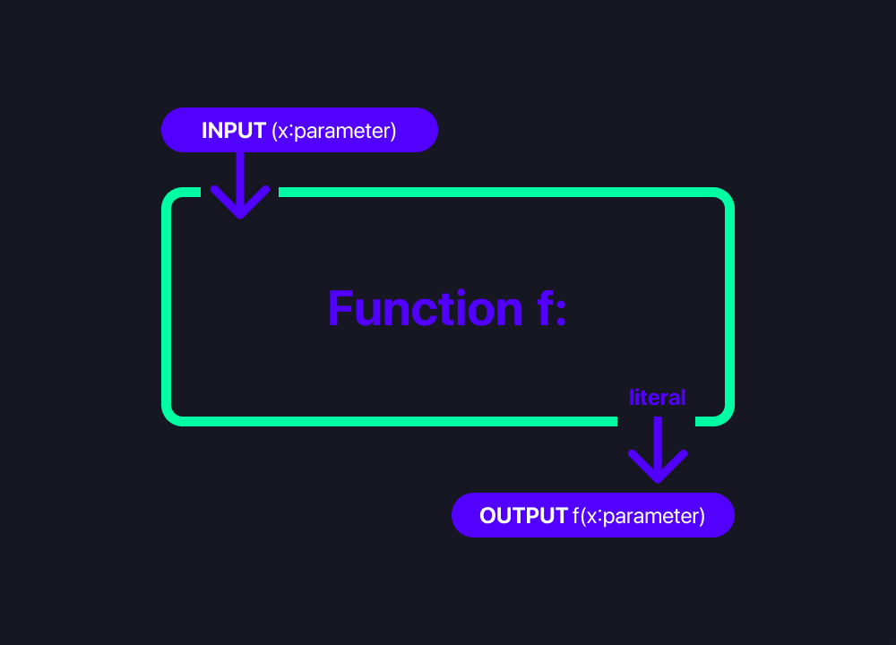
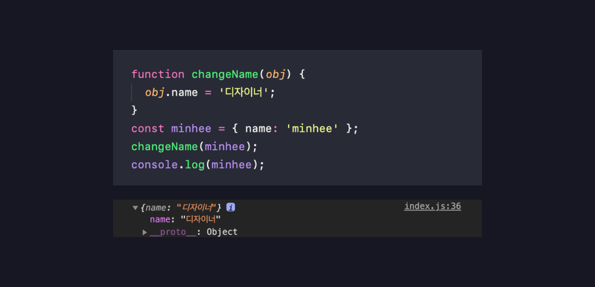

# 04_함수의선언과 표현

**<span style="color:#4886FF">TITLE</span> : 함수의선언과 표현**

**<span style="color:#4886FF">목차</span>**

- [01.function](##01.funtion)
- [02.Parameters](##02.Parameters)
- [03.Default Parameters](##03.DefaultParameters)
- [04.Rest Parameters](##04.RestParameters)


<br>
<br>


## **01.function**

프로그램안에서 각각 저마다의 기능을 수행하는 함수들이 존재한다.

프로그램안에서 각각의 작은 단위를 수행하는 것이 Function이다.


  
input(parameter) 를 받아서 이것들을 잘 처리한 후 
output(literal) 하는 것이 바로 Function이다. 

언어 자체의 존재하는 funtion들을 쓸 때 ,API (Application Programming Interface)를 쓸 때 
함수의 이름을 보고 이 함수는 이런 일을 하겠구나 생각할 수 있다. 

전달해야하는 parameter들이 무엇인지 어떤 값이 Return되길 기대할 수 있는지 이런 인터페이스를 보고 
예상할 수 있다.

그래서 함수에는 input과 output이 중요하고 
함수이름을 잘 정하는 것이 중요하다.

**선언하는 법**
```
function name(param1, param2){body...return;}
// 펑션 키워드를 이용하고 함수이름을 지정하고(파라미터를 나열하고){함수안에 기본적인 비즈니스 로직을 작성하고 리턴해준다.}
```
- 하나의 함수는 한 가지 일만 하도록 해야한다.
- 함수는 무언가를 동작하는 것이기 때문에 doSometing, command, verb 동사형태로 이름을 지정해야한다.
- JS에서 function은 object이다. 
  - 그렇기 때문에 변수에 할당이 가능하고, 파라미터로 전달이 가능하고 함수를 리턴할 수 있다.

- JS는 타입이 없다. 
  ```
  function log(message) {
   console.log(message);  
  }
  ```
  - 이와 같이  `message`가 string 타입인지 number타입인지 어떤 데이터타입인지 알 수 없다.

  - 반면 **타입스크립트**는 타입을 확실히 명시해줘야함 
  ```
    function log(message : string) {
    console.log(message);
    }
  ```
    [ 🔗 TypeScript 맛보기](https://www.typescriptlang.org/play?#code/PTAEHUFMBsGMHsC2lQBd5oBYoCoE8AHSAZVgCcBLA1UABWgEM8BzM+AVwDsATAGiwoBnUENANQAd0gAjQRVSQAUCEmYKsTKGYUAbpGF4OY0BoadYKdJMoL+gzAzIoz3UNEiPOofEVKVqAHSKymAAmkYI7NCuqGqcANag8ABmIjQUXrFOKBJMggBcISGgoAC0oACCoASMFmgY7p7ehCTkVOle4jUMdRLYTqCc8LEZzCZmoNJODPHFZZXVtZYYkAAeRJTInDQS8po+rf40gnjbDKv8LqD2jpbYoACqAEoAMsK7sUmxkGSCc+VVQQuaTwVb1UBrDYULY7PagbgUZLJH6QbYmJAECjuMigZEMVDsJzCFLNXxtajBBCcQQ0MwAUVWDEQNUgADVHBQGNJ3KAALygABEAAkYNAMOB4GRogLFFTBPB3AExcwABT0xnM9zsyhc9wASmCKhwDQ8ZC8iElzhB7Bo3zcZmY7AYzEg-Fg0HUiS58D0Ii8AoZTJZggFSRxAvADlQAHJhAA5SASAVBFQAeW+ZF2gldWkgx1QjgUrmkeFATgtOlGWH0KAQiBhwiudokkuiIgMHBx3RYbC43CCJUUJWSXFgqAo8C8ypVyEEQJdoHy11QlE4zD1oAA3kP0dSFZAlfBVbP55A9QBuRQAXyAA)


## **02.Parameters**

`function`에 전달되는 `parameters` 들은 두 타입이 있다.

- premitive : 메모리에 value가 저장되어 있어 value가 전달된다.

- object : 메모리에 reference가 저장되어 reference가 전달된다.


  **<span style="color:#4886FF">object EX</span>**

  ```
  function changeName(obj) {
   obj.name = '디자이너';
  }
  ```
  👆 changeName이라는 function은 전달된 object의 이름을 디자이너로 무조건 변경하는 함수이다.

  ```
  const minhee = { name: 'minhee' };
  ```
  👆 minhee라는 const를 정의하고, minhee라는 Object를 만들어서 할당해주면 메모리에는 Object가 만들어진 reference가 들어간다.

  👆 이 reference는 object를 메모리 어딘가에 가르키고 있다.

  ```
  changeName(minhee);
  console.log(minhee);
  ```
  👆 그래서 `changeName(minhee)`전달하게 되면 전달된 `obj.name = '디자이너';`,  `name: 'minhee'` minhee가 가르키고 있는 이름을 `'디자이너'`로 출력하게 된다.

  


<br>
<br>


## **03.Default Parameters**

ES6 추가되어진 친구이다.

```
function showMessage(message, from) {
  console.log(`${message} by ${from}`);
}

showMessage('hi!');
```
  - `${message}` 가 `by${from}` 누구로부터 왔는지 알려준다.

  

  - 👆 `showMessage('hi!');`를 호출할 때 message만 전달된 걸 볼 수 있다.
  
  - from이 정의되어있지 않기 때문이다.
  
  ```

  function showMessage(message, from) {

  if (from === undefined) {
    from = 'unknown';
  }

   console.log(`${message} by ${from}`);
  }

  showMessage('hi!');
  ```
  - 때문에 ` if (from === undefined) {
    from = 'unknown';
  }` 을 통해 `from` 이 `undefined`일 때 원하는 문구를 출력하도록 했다.

  **하지만 지금은!**

  ```
  function showMessage(message, from = 'unknown') {


  console.log(`${message} by ${from}`);
  }

  showMessage('hi!');
  ```
  - `from = 'unknown'` parameter옆에 원하는 Default 값을 지정해 놓을 수 있게됐다.


<br>
<br>


## **04.Rest Parameters**

ES6 추가되어진 친구이다.

