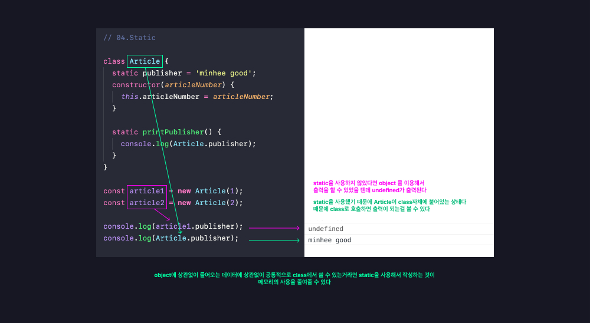
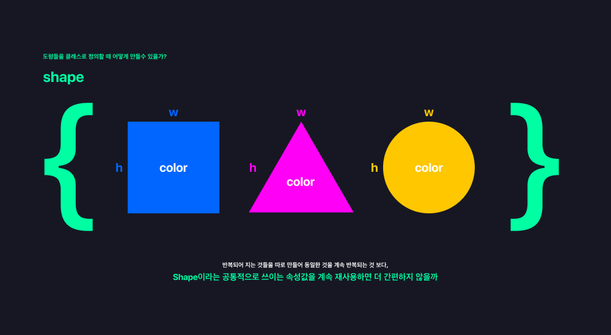
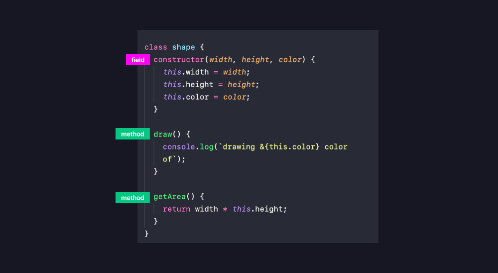
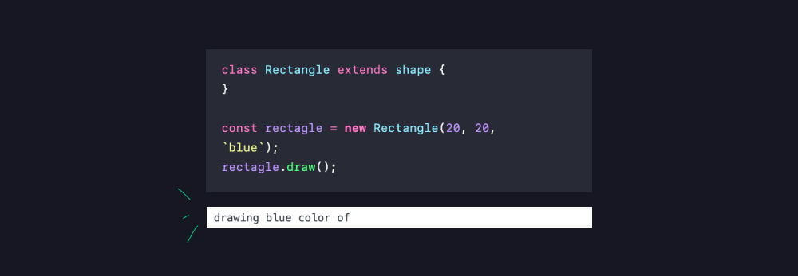
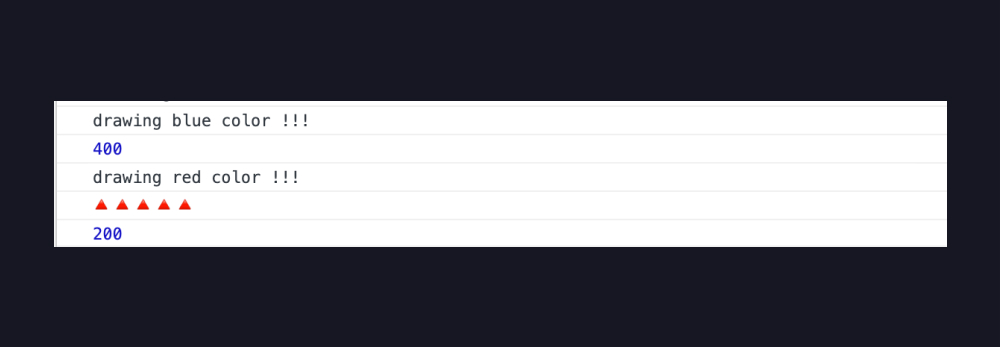

# 05_클래스와 오브젝트 

**<span style="color:#4886FF">TITLE</span> : 함수의선언과 표현**

**<span style="color:#4886FF">목차</span>**

- [01.Class와Object](##01.Class와Object)
- [02.Getter & Setter](##02.Getter&Setter)
- [03.Public & Private](##03.Public&Private)
- [04.Static](##04.Static)
- [05.상속과 다양성](##05.상속과다양성)
- [06.instanceOf](##06.instanceOf)

<br>
<br>


## **01.Class와Object**

클래스는 조금 더 연관있는 데이터를 한 곳에 묶어놓는 컨테이너같은 친구이다.

```
class person {
  name;  // field 속성
  age; // field 속성
  speak(); // method 행동
}
```
- `field` 와 `method` 가 종합적으로 묵였는 것을 말한다. 
- `field`만 들어있는 클래스를 데이터 클래스라고 한다.
- 상속과 다양성이 일어난다. 
- 이 모든 것들이 가능한 것이 `객체지향언어`라고 한다. 


클래스는 어떤 것을 만들 수 있는 **틀**이라고도 부른다.

- 청사진, 템플릿이라고도 부른다. 
- 이 클래스는 이런 이런 데이터가 들어올 수 있어! 라고 정의를 해놓고 한 번만 선언한다. 틀을 만들어 놓는 것이다. 

그래서 이 클래스를 이용해서 실제로 데이터를 넣어 만드는 것이 `object` 이다.

- instance of a class
  - 클래스를 이용해서 새로운 `instance`를 생성하면 `object`가 된다. 
- created many time 
  - 클래스를 이용해서 굉장히 많이 만들 수 있다.
- date in 
  - 클래스는 정의만 한 것이라 메모리에 올라가진 않지만 실제로 데이터를 넣으면 메모리에 올라가게 된다.


<br>
<br>
<br>

## **Class 선언**

```
class Person {
  // constructor 생성자 
  constructor(name, age) {
    // fields 
    this.name = name;
    this.age = age;
  }

  //methods 메소드 
  speak() {
    console.log(`${this.name}: hello!`)
  }
}
```
- `constructor 생성자` 를 이용해서 나중에 오브젝트를 만들 때 필요한 데이터를 전달한다. 


## **Object 생성**

```
const minhee = new Person('minhee', 27);
console.log(minhee.name);
console.log(minhee.age);
minhee.speak();

```

- this는 생성된 object를 지칭한다. 

<br>
<br>

## **02.Getter & Setter**

```
class User {
  constructor(firstName, lastName, age) {
    this.firstName = firstName;
    this.lastName = lastName;
    this.age = age;
  }
}

const user1 = new User('Steve', 'job', -1);
console.log(user1.age);
```
- 위 `object`에서 user1의 나이가 -1인 것이 말이 되지않는다.(이런 경우가 생길것을 가장하여)

이런 경우에 `Getter & Setter` 를 사용한다.
```
class User {
  constructor(firstName, lastName, age) {
    this.firstName = firstName;
    this.lastName = lastName;
    this.age = age;
  }

  get age() {
    return this.age;
  }

  set age(value) {
    this.age = value;
  }
}
```

- `get`이라는 kyeword를 이용해서 값을 `return`하고 
- `set`이라는 kyeword를 이용해서 값을 설정할 수 있다. 
  - 값을 설정하기 때문에 `value`를 받아와야 한다.

 **<span style="color:#4886FF">주의할 점</span>**


- 👆 위 현상 때문에 call stack이 다 찼다는 경고가 나오게된다.
- 이걸 방지하기 위해서 getter와 setter안에서 쓰여지는 변수명을 다르게 써야한다.(위 이미지는 이미 바꾸어놓음)


```
class User {
  constructor(firstName, lastName, age) {
    this.firstName = firstName;
    this.lastName = lastName;
    this.age = age;
  }

  get age() {
    return this._age;
  }

  set age(value) {
    if (value < 0) {
      throw Error(`age can not be negative`);
    }

    this._age = value;
  }
}
```


- 마이너스 값을 보내면 경고창이 뜬다!   
  - 다소 거칠게 에러를 보내는 것이 마음에 걸린다면 
  ```   this._age = value < 0 ? 0 : value; ``` 을 통해서 
  밸류가 마이너스 값이라면 0을 쓰고 아니면 지정된 밸류를 쓰겠다. 라고 표현할 수도 있다.

- 변수명이 다르지만 (기호가 들어가있는) `.age`라고 호출할 수 있고 값을 할당할 수 있는건 `Getter & Setter`를 이용했기 때문이다. 

<br>
<br>

## **03.Public&Private**

가장 최근에 추가된 것이라 사파리에서도 지원이 안된다. 

지금 쓰기에는 이르지만 있다는 것만 알고있자.

```
class Experiment {
  publicField = 2; // 그냥 정의하면 퍼블릭 
  #privateField = 0; // 해시기호를 붙이면 프라이빗 
}

const experiment = new Experiment(); // 생성자를 쓰지않고 필드를 정의할 수 있다. 
console.log(experiment.publicField);
console.log(experiment.privateField);
```
- `Public` : 퍼블릭하게 보여지고 접근도 가능함.
- `Private` : 클래스 내부에서만 값이 보여지고 접근, 변경이 가능하지만 클래스 외부에서는 값을 읽을수도 변경할 수도 없다.

<br>
<br>

## **04.Static**

이것도 지금 쓰기에는 이르지만 있다는 것만 알고있자.

```
class Article {
  static publisher = 'minhee good';
  constructor(articleNumber) {
    this.articleNumber = articleNumber;
  }

  static printPublisher() {
    console.log(Article.publisher);
  }
}
```
- 클래스안에 있는 `field` 와 `method`들은 새로운 `object`를 만들 때 마다 복제되어서 값만 지정된 값으로 변경되어서 만들어진다.


 간혹 이런 `object`, data에 상관없이 클래스가 가지고있는 고유의 값과 동일하게 반복되서 사용되는 `method`가 있을 수 있다. 

 그런 것들을 `static`이라는 키워드를 이용해서 붙이면 `object`와 상관없이 클래스 자체에 연결되어있다. 




<br>
<br>

## **05.상속과다양성**


- 타이핑도 줄어들고, 재사용이 가능하기 때문에 유지보수에도 좋다. 


```

class shape {
  constructor(width, height, color) {
    this.width = width;
    this.height = height;
    this.color = color;
  }

  draw() {
    console.log(`drawing ${this.color} color of`);
  }

  getArea() {
    return width * this.height;
  }
}

```
- `shpae` 이라는 `class`안에 도형의 공통 속성인 `width` `height` `color` 가 `field`있고. 
-  `drow()` `getArea()` 라는  `method`가 들어있다.

<br>

### **사각형을 그리고싶다면?**

위 속성들을 반복해서 타이핑하는 것이 아니라 **`extends`**  라는 키워드를 이용해서 `shape`을 연장해서 사용할 수 있다. 

```
class Rectangle extends shape {
}

// 호출해보기
const rectagle = new Rectangle(20, 20, `blue`);
rectagle.draw();
```
- 이렇게만 정의해도 `shape`에서 정의한 속성들이 자동적으로 `Rectangle`에 포함된다. 


- 👆 잘 호출되는 모습 


``` 
class Rectangle extends shape { }
class Triangle extends shape { }

const rectagle = new Rectangle(20, 20, `blue`);

rectagle.draw();

const triangle = new Triangle(20, 20, `red`);

triangle.draw();

```
- 👆 다른 도형들을 더 만들고 싶을 때도 위와 같이 추가하기면 하면 된다.

- 동일한 값들을 계속 재사용할 수 있고, 잘못되어도 `shape` 이라는 `class`만 수정해주면 동일하게 수정이 된다. 

<br>
<br>

### **다양성 더 알아보기**

- 필요한 함수만 바로 재 정의하여 사용할 수 있다. 
- 이것을 **`Overriding`** 이라고 한다. 
  - `Overriding`한 함수들은 재정의되었기 때문에 기존의 클래스로 정의했던 함수들은 호출이 안된다. 
  -  공통적으로 정의했던 함수도 함께 호출하고 싶다면 `super` 라는 키워드를 이용하면 된다. 

``` 
class shape {
  constructor(width, height, color) {
    this.width = width;
    this.height = height;
    this.color = color;
  }

  draw() {
    console.log(`drawing ${this.color} color !!!`);
  }

  getArea() {
    return this.width * this.height;
  }
}

class Rectangle extends shape { }
class Triangle extends shape {
  draw() {
    super.draw();
    // 공통적으로 정의했던 함수도 호출하기위해 사용

    console.log(`🔺🔺🔺🔺🔺`)
    // 삼각형을 조금 다르게 호출하고싶어서 재정의 
  }

  getArea() {
    return (this.width * this.height) / 2;
    // 삼각형의 면적구하기 공식이 다르기 때문에 이렇게 재정의 
  }
}

const rectagle = new Rectangle(20, 20, `blue`);

rectagle.draw();
console.log(rectagle.getArea());

const triangle = new Triangle(20, 20, `red`);

triangle.draw();
console.log(triangle.getArea());

```


<br>
<br>

## **06.instanceOf**

클래스를 위해서 만들어진 새로운 `instance`이다.

`console.log(rectagle instanceof Rectangle);`
- 왼쪽에 있는 `object`(rectagle)가 오른쪽에 `class`(Rectangle)의 `instance`인지 아닌지 알려주는 친구이다. 

- 즉 `object`가 `class`이용해서 만들어진 아이인지 아닌지 확인해주는 것이다. 

- `true`와 `false`로 알려준다.

```
console.log(rectagle instanceof Rectangle); // true
console.log(triangle instanceof Rectangle); //false
console.log(triangle instanceof Triangle); //true
console.log(triangle instanceof shape); // true
console.log(triangle instanceof Object); // ture 
```
- `console.log(triangle instanceof Object);` : `triangle`은 `Object`의 `instance`인가? 
  - 맞다, JS만든 모든 `Object` `class`들은 JS의 `Object`를 상속한 것이다.


<br>
<br>


[ 🔗 JavaScript Reference MDN](https://developer.mozilla.org/en-US/docs/Web/JavaScript/Reference) 

- JS내부에 포함되어있는 `object`는 어떤 것들이 있는지 볼 수 있다. 


<br>
<br>


## 새롭게 알게 된 것

문법이 조금 익숙해져가는 느낌이다. 
**05.상속과다양성** 파트가 특히 흥미로웠다. 

## 더 알아야 할 것 

슬슬 실제로 무언갈 만들어가면서 이론을 몸으로 체감해야할 것 같다. 

워낙 내용이 방대하여 이전 내용들을 잊어버리거나 하는 경우가 많아 학습이 학습이 아닌 게 되어가는 것 같다.


---

### **Reference**
<a href="https://youtu.be/_DLhUBWsRtw?t=840">
</a>