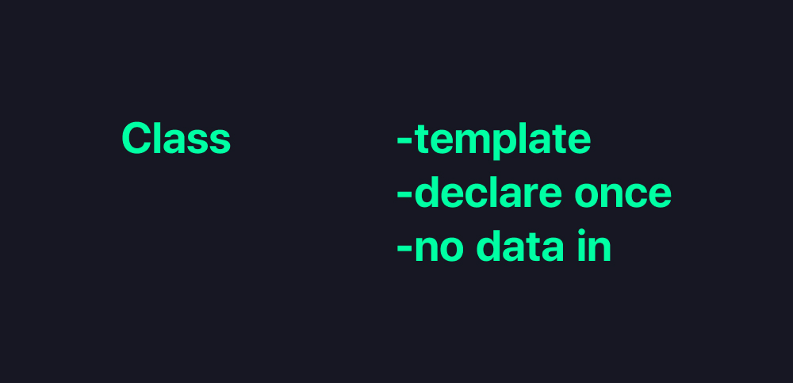
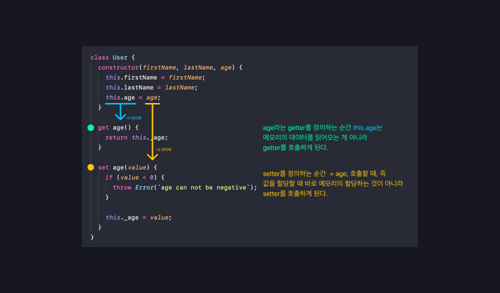
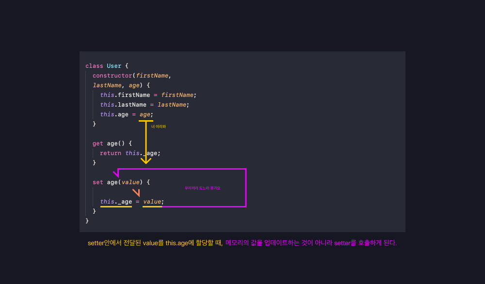
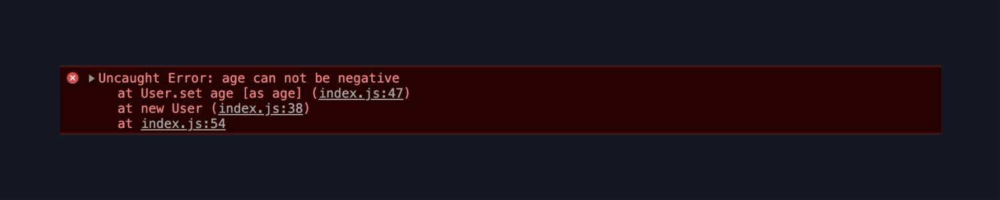

# 05_클래스와 오브젝트 

**<span style="color:#4886FF">TITLE</span> : 함수의선언과 표현**

**<span style="color:#4886FF">목차</span>**

- [01.Class와Object](##01.Class와Object)
- [02.Getter & Setter](##02.Getter&Setter)

<br>
<br>


## **01.Class와Object**

클래스는 조금 더 연관있는 데이터를 한 곳에 묶어놓는 컨테이너같은 친구이다.

```
class person {
  name;  // field 속성
  age; // field 속성
  speak(); // method 행동
}
```
- `field` 와 `method` 가 종합적으로 묵였는 것을 말한다. 
- `field`만 들어있는 클래스를 데이터 클래스라고 한다.
- 상속과 다양성이 일어난다. 
- 이 모든 것들이 가능한 것이 `객체지향언어`라고 한다. 



클래스는 어떤 것을 만들 수 있는 **틀**이라고도 부른다.

- 청사진, 템플릿이라고도 부른다. 
- 이 클래스는 이런 이런 데이터가 들어올 수 있어! 라고 정의를 해놓고 한 번만 선언한다. 틀을 만들어 놓는 것이다. 

그래서 이 클래스를 이용해서 실제로 데이터를 넣어 만드는 것이 `object` 이다.

- instance of a class
  - 클래스를 이용해서 새로운 `instance`를 생성하면 `object`가 된다. 
- created many time 
  - 클래스를 이용해서 굉장히 많이 만들 수 있다.
- date in 
  - 클래스는 정의만 한 것이라 메모리에 올라가진 않지만 실제로 데이터를 넣으면 메모리에 올라가게 된다.


<br>
<br>
<br>

## **Class 선언**

```
class Person {
  // constructor 생성자 
  constructor(name, age) {
    // fields 
    this.name = name;
    this.age = age;
  }

  //methods 메소드 
  speak() {
    console.log(`${this.name}: hello!`)
  }
}
```
- `constructor 생성자` 를 이용해서 나중에 오브젝트를 만들 때 필요한 데이터를 전달한다. 


## **Object 생성**

```
const minhee = new Person('minhee', 27);
console.log(minhee.name);
console.log(minhee.age);
minhee.speak();

```

- this는 생성된 object를 지칭한다. 

<br>
<br>

## **02.Getter & Setter**

```
class User {
  constructor(firstName, lastName, age) {
    this.firstName = firstName;
    this.lastName = lastName;
    this.age = age;
  }
}

const user1 = new User('Steve', 'job', -1);
console.log(user1.age);
```
- 위 `object`에서 user1의 나이가 -1인 것이 말이 되지않는다.(이런 경우가 생길것을 가장하여)

이런 경우에 `Getter & Setter` 를 사용한다.
```
class User {
  constructor(firstName, lastName, age) {
    this.firstName = firstName;
    this.lastName = lastName;
    this.age = age;
  }

  get age() {
    return this.age;
  }

  set age(value) {
    this.age = value;
  }
}
```

- `get`이라는 kyeword를 이용해서 값을 `return`하고 
- `set`이라는 kyeword를 이용해서 값을 설정할 수 있다. 
  - 값을 설정하기 때문에 `value`를 받아와야 한다.

 **<span style="color:#4886FF">주의할 점</span>**


- 👆 위 현상 때문에 call stack이 다 찼다는 경고가 나오게된다.
- 이걸 방지하기 위해서 getter와 setter안에서 쓰여지는 변수명을 다르게 써야한다.(위 이미지는 이미 바꾸어놓음)


```
class User {
  constructor(firstName, lastName, age) {
    this.firstName = firstName;
    this.lastName = lastName;
    this.age = age;
  }

  get age() {
    return this._age;
  }

  set age(value) {
    if (value < 0) {
      throw Error(`age can not be negative`);
    }

    this._age = value;
  }
}
```


- 마이너스 값을 보내면 경고창이 뜬다!   
  - 다소 거칠게 에러를 보내는 것이 마음에 걸린다면 
  ```   this._age = value < 0 ? 0 : value; ``` 을 통해서 
  밸류가 마이너스 값이라면 0을 쓰고 아니면 지정된 밸류를 쓰겠다. 라고 표현할 수도 있다.

- 변수명이 다르지만 (기호가 들어가있는) `.age`라고 호출할 수 있고 값을 할당할 수 있는건 `Getter & Setter`를 이용했기 때문이다. 


**... 추가 업데이트 예정**


---

### **Reference**
<a href="https://youtu.be/_DLhUBWsRtw?t=840">
</a>