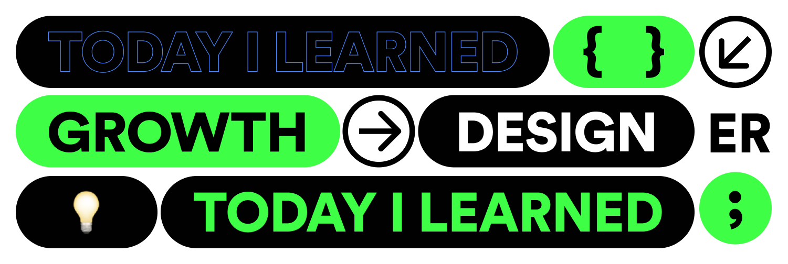

# **✨2020.12.28 STRAT✨** 

### **TIL RULE** 
### 📌 매일은 아니어도 주에 한 번이라도 한다.  
### 📌 작성규칙은 만들어 둔 폼을 적극 활용한다.  
### 📌 내가 다시 읽었을 때, 이해할 수 있도록 작성한다.  
### 📌 반드시 복습한다.  

 

# **Why** 

### 내가 나를 독려하기 
* **인터랙션에 계속 관심을 가지다 보니, FramerX를 거쳐 여기까지 오게 됐습니다.**
 프로토타입 이상으로 실제 구현 가능한 그림을 그릴 수 있다면, 간단한 랜딩 페이지 하나 정도는 스스로 구축해낼 수 있다면 이라는 바람을 계속 가지고 있었습니다. 

* **플랫폼 디자인 업무를 하다보니 얕은 개발지식도 도움이 되는 걸 깨달았습니다.**
  현재의 업무가 재밌고 이 작은 도움을 더 발전해 나가고 싶어 TIL을 더 꼼꼼히 작성해서 온전히 내 것으로 만들어야 한다는 생각이 들었습니다.

* **동료가 알려준 좋은 습관을 꾸준히 지켜나가고 싶어요.**
  이런 게 있어! 알려주는 동료가 있어 2020년엔 무척 감사했어요. 그 동료에게 받은 감사함을 꾸준히 이어나가고 싶습니다.

* **개발공부는 생각 확장에 굉장히 큰 도움이 됩니다.** 
  구현가능한 디자인만 생각하느라 디자인에 제약이 생긴다는 이야기를 참 많이 들었는데, 오히려 개발자들과 대화하면서 제약을 어떤식으로 극복할까? 라는 대화를 더 많이 할 수 있었습니다. 

* **무엇보다 재밌습니다.** 
  기록하고 다시 읽어보는 즐거움이 있어요.

