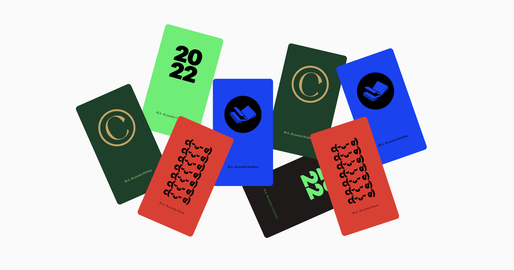

# **✨Loosely I Learned 2022✨**

### **✨LIL RULE** - 2020.12.28 STRAT✨

#### 📌 매일은 아니어도 주에 한 번이라도 한다.  

#### 📌 작성규칙은 만들어 둔 폼을 적극 활용한다.  

#### 📌 내가 다시 읽었을 때, 이해할 수 있도록 작성한다.  

#### 📌 반드시 복습한다.  

 

# **Why**

- **인터랙션,플랫폼 업무를 하다보니 자연스럽게 관심을 가지게 됐어요.**
    제가 좋아하는 일을 더 잘 하려 하다 보니 자연스럽게 하게 됐어요.

- **생각 확장에 굉장히 큰 도움이 됐어요.**
    디자이너에게 구체적인 상상을 할 수 있도록 도와줘요.

- **얕은 개발지식이라도 분명 도움이 돼요.**
    잘할 필요는 없어요, 얕지만 알고있는 정도도 업무에 도움이 돼요.

- **동료가 알려준 좋은 습관을 꾸준히 지켜나가고 싶어요.**
    이런 게 있어! 알려주는 동료가 있어 2020년엔 무척 감사했어요. 그 동료에게 받은 감사함을 꾸준히 이어나가고 싶어요.

- **무엇보다 재밌어요.**
    기록하고 다시 읽어보는 즐거움이 있어요.

- **Loosely.**
    매일 해야한다는 강박은 재미를 감소시켜요. 느슨하더라도 꾸준히 이어나가는 게 더 중요해요.

---

### _BACK UP_

