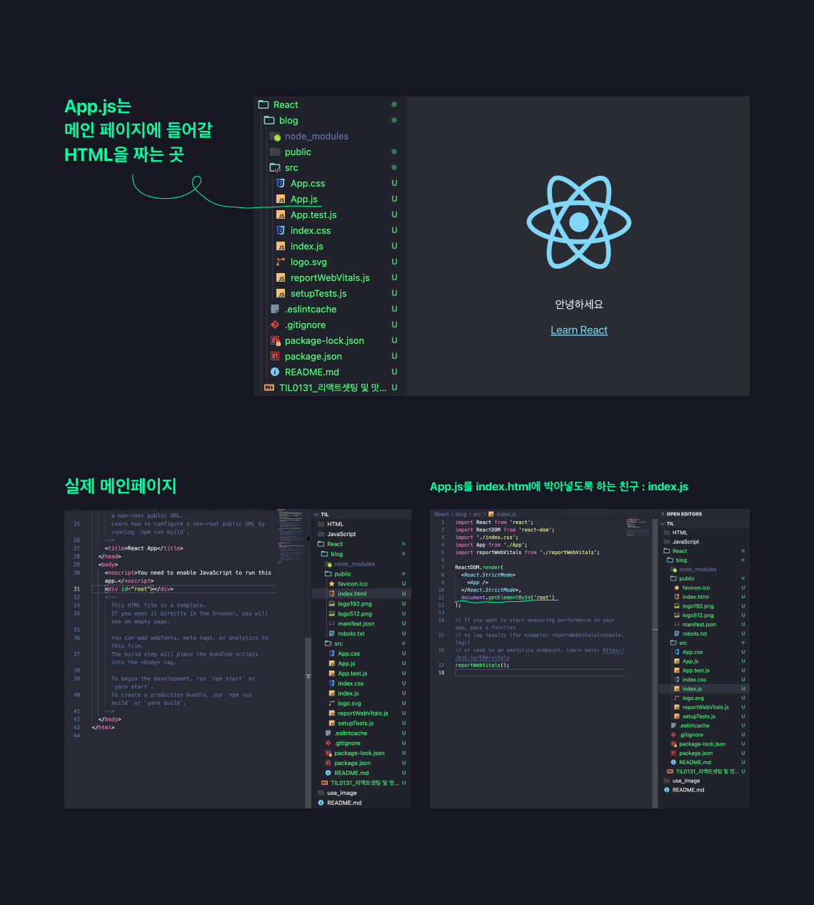

# 01_리액트 설치 및 셋팅 

## **설치**

01. nodejs를 설치한다.

**왜 설치하는가?**

- npm이라는 툴 사용이 가능하다. 
- `create-react-app` 라이브러리 때문이다. 

02. 파일구조 살펴보기



- public 폴더  
  - static파일 보관함 
- src 폴더 
  - 소스코드 보관함 
- package.json 
  - 설치한 라이브러리 목록 


---
# 02_HTML대신 JSX 써보기 

```
function App() {
  return (
    <div className="App">
      <div className="head-sty">
        이게말이되냐
      </div>
    </div>
  );
}
```
- 위 형태가 JSX, JavaScript에 대한 구문 확장이다. 
- 위 코드에 스타일을 입히는 것 또한 HTML/CSS에서 작성하는 것과 유사하다. 

``` 

.head-sty {
  background-color: #0064FF;
  width: 100%;
  display: flex;
  color:white;
  padding: 18px;
  font-weight: 600;
  font-size: 24px;
}

```

### 이렇게 비슷하면 왜 HTML/CSS 안쓰고 React써요? 

- **데이터 바인딩이 쉽다.**
  - 데이터 바인딩 : 데이터를 HTML에 넣는 것을 말한다. 

바닐라 JS에서 데이터 바인딩 하는 법 
```
document.getElementById().innerHTML = ''? 
```

React에서 데이터 바인딩 하는 법 

```
function App() {

  let posts = '개츠비블로그만들거야앗';

  return (
    <div className="App">
      <div className="head-sty">
        이게말이되냐
      </div>
      <h2> {posts} </h2>
    </div>
  );
}
```

<br>
<br>

## 새롭게 알게 된 것

React 구조와 장점을 알게되었다!

왜 좋은지 설명하라고 하면 적어도 확실히 하나는 말할 수 있게 된 것 

확실히 자바스크립트를 아주 조금 만져본 상태라 이해가 되었고, 

공감대가 형성되긴 했다. 


## 여전히 막연한 것 

React를 맛보니 역시 자바스크립트로 돌아가서 

사이트 하나를 완성시킨 후에 다시 와야겠다는 생각이 들었다. 


---

### **Reference**
<a href="https://www.youtube.com/watch?v=nahwuaXmgt8">
</a>